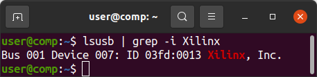
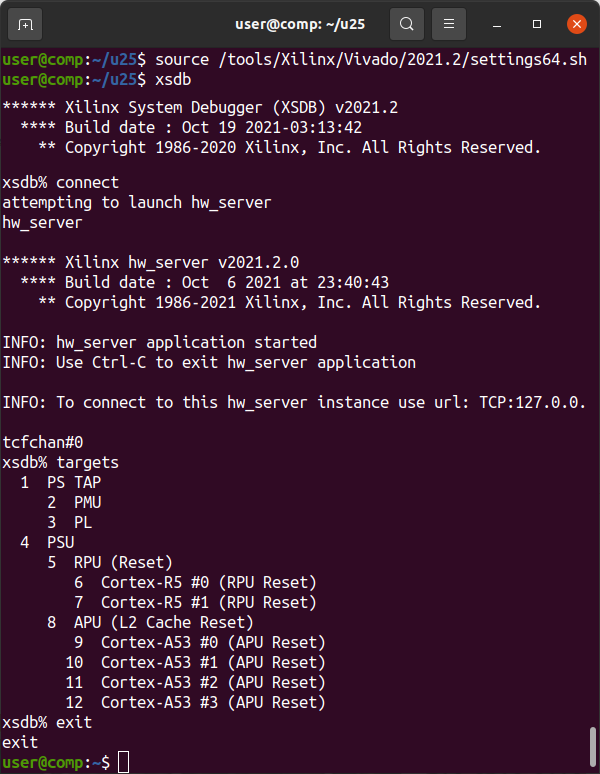
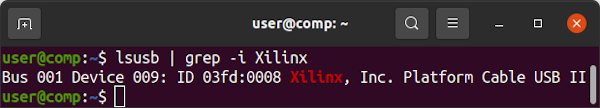
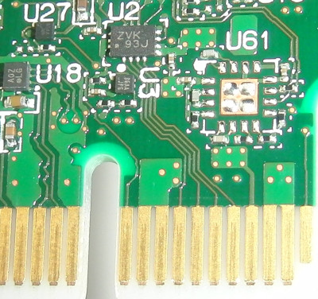
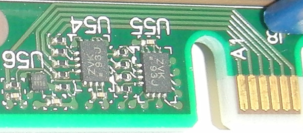

**Work-In-Progress**

# Alveo U25 Setup and Usage Notes

Currently focused on trying to [debug a faulty Alveo U25](debug_log.md).

The [Alveo U25](https://www.xilinx.com/content/dam/xilinx/publications/product-briefs/alveo-u25-product-brief.pdf) is based on the [XCU25](https://en.wikipedia.org/w/index.php?title=List_of_Xilinx_FPGAs&oldid=1129244401)==[XCZU19EG-FFVC1760](https://www.xilinx.com/products/silicon-devices/soc/zynq-ultrascale-mpsoc.html#eg).


## JTAG Using UrJTAG

[UrJTAG](http://urjtag.org) is a low-level tool for communicating with JTAG devices. It supports [Xilinx Platform Cable USB II](https://docs.xilinx.com/v/u/en-US/ds593) adapters and [clones](https://www.waveshare.com/platform-cable-usb.htm). Main use is *EXTEST* pin toggling although it is theoretically possible to program the FPGA using an [SVF file generated from the Vivado Tcl Console](https://docs.xilinx.com/r/2021.2-English/ug908-vivado-programming-debugging/Using-the-Command-Line?tocId=L2PEfMkFFNtSZI~r7QbNVg).


### Compile and Install UrJTAG

```Shell
cd ~
wget https://downloads.sourceforge.net/project/urjtag/urjtag/2021.03/urjtag-2021.03.tar.xz
sha256sum urjtag-2021.03.tar.xz
echo b0a2eaa245513af096dc4d770109832335c694c6c12aa5e92fefae8685416f1c should be the SHA256 Checksum
tar -xvf urjtag-2021.03.tar.xz
cd urjtag-2021.03/
./configure
make
sudo make install
sudo ldconfig
```

### Create UrJTAG-Compatible JTAG Definition Files from BSDL Files

Xilinx's [Zynq Ultrascale+ BSDL Files](https://www.xilinx.com/member/forms/download/sim-model-eval-license-xef.html?filename=bsdl_zynquplus_2021_2.zip) include `STD_1149_6_2003.all` definitions that UrJTAG's `bsdl2jtag` cannot process and must therefore be removed. The included [xczu19eg_ffvc1760.jtag](xczu19eg_ffvc1760.jtag) and [zynqu_arm_dap.jtag](zynqu_arm_dap.jtag) files are processed and tested to work with UrJTAG.

### Add XCZU19EG FFVC1760 JTAG Bit Definitions to UrJTAG

From the directory containing the `.jtag` files run the following commands which create *PART* and *STEPPINGS* files for the XCZU19EG. These commands assume UrJTAG installed support files to the default `/usr/local/share/` directory. Values were found by running the UrJTAG `detect` command which reads the `Device Id` from the JTAG chain. First 4 bits (`0001`) are the *STEPPING*, next 16 bits (`0100011101011000`) are the *PART*, last 12 bits (`01000111011`) are the *MANUFACTURER*.
```Shell
sudo su
echo "# Zynq Ultrascale+ (XCZUxxEG)" >>/usr/local/share/urjtag/xilinx/PARTS
echo -e "0100011101011000\txczu19eg_1760\txczu19eg_ffvc1760" >>/usr/local/share/urjtag/xilinx/PARTS
mkdir /usr/local/share/urjtag/xilinx/xczu19eg_1760
touch /usr/local/share/urjtag/xilinx/xczu19eg_1760/STEPPINGS
echo "0001 xczu19eg_1760 1" >>/usr/local/share/urjtag/xilinx/xczu19eg_1760/STEPPINGS
echo "0000 xczu19eg_1760 0" >>/usr/local/share/urjtag/xilinx/xczu19eg_1760/STEPPINGS
cp xczu19eg_ffvc1760.jtag /usr/local/share/urjtag/xilinx/xczu19eg_1760/xczu19eg_1760
echo -e "01000111011\tarm\t\tARM"  >>/usr/local/share/urjtag/MANUFACTURERS
mkdir /usr/local/share/urjtag/arm
touch /usr/local/share/urjtag/arm/PARTS
echo -e "1011101000000000\tzynqu_arm_dap\tzynqu_arm_dap" >>/usr/local/share/urjtag/arm/PARTS
mkdir /usr/local/share/urjtag/arm/zynqu_arm_dap
touch /usr/local/share/urjtag/arm/zynqu_arm_dap/STEPPINGS
echo "0101 zynqu_arm_dap 5" >>/usr/local/share/urjtag/arm/zynqu_arm_dap/STEPPINGS
cp zynqu_arm_dap.jtag /usr/local/share/urjtag/arm/zynqu_arm_dap/zynqu_arm_dap
exit
```


#### Connect JTAG Adapter and Allow Vivado to Update Platform Cable USB II Firmware

Connect your JTAG Adapter to the Alveo U25.


If you are using a Platform Cable USB II compatible adapter it will show up under `lsusb` as `03fd:0013 Xilinx, Inc.` In this state it _CANNOT_ be used for JTAG.



Run Xilinx's `xsdb` which comes with Vivado:
```
source /tools/Xilinx/Vivado/2021.2/settings64.sh
xsdb
```

In `xsdb` run `connect`, wait a minute, then run `targets` until the Zynq shows up, then `exit`.



`lsusb` should now show `03fd:0008 Xilinx, Inc. Platform Cable USB II`. The JTAG adapter is ready to be used by UrJTAG.




#### Begin a UrJTAG Session

`sudo jtag` to start UrJTAG with access to USB. You should see the `jtag> ` command prompt. A [JTAG Overview](https://www.xjtag.com/about-jtag/jtag-a-technical-overview/) may be helpful before you begin. Note that `shift ir` and `shift dr` need to be run to change the debug target's state. Running `instruction` commands only changes UrJTAG's internal state.

Valid signal names can be found in the [xczu19eg_ffvc1760.jtag](https://github.com/mwrnd/notes/blob/f52bbadc220d22232c5bf39dd608829c7e002867/Alveo_U25/xczu19eg_ffvc1760.jtag#L1054) file.

`cable xpc_ext` selects the Xilinx Platform Cable II, external JTAG chain

`detect` finds all devices in the JTAG chain

`print chain` prints all devices in the JTAG chain

`part 1` selects the Zynq for JTAG communication. Good practise to always make this explicit.

`instruction EXTEST` select the External Test Function

`shift ir` shifts EXTEST into the JTAG Instruction Register to put the device into EXTEST mode

`shift dr` shifts the Data Register containing all pin states into UrJTAG memory

`dr` prints the full contents of the JTAG Data Register.

It is more useful to read individual signals:

`get signal PS_MODE0` displays the value of pin PS_MODE0(AA27)

`get signal PS_MODE1` displays the value of pin PS_MODE1(AC28)

`get signal PS_MODE2` displays the value of pin PS_MODE2(AA28)

`get signal PS_MODE3` displays the value of pin PS_MODE3(AB28)

The above MODE pins define Quad-SPI as the [Boot Mode](https://docs.xilinx.com/r/en-US/ug1085-zynq-ultrascale-trm/Boot-Modes).

`get signal PS_ERROR_OUT` indicates a Power, Hardware, or PMU Exception when =1.

`get signal PS_INIT_B` indicates a CRC Error in the PL Bitstream when =1.

`get signal PS_ERROR_STATUS` indicates a lockdown state or PMU Status Error when =1.

`get signal PS_DONE` indicates PL Configuration completed when =1.

`reset` resets the JTAG chain and enters Bypass Mode

`quit` exits UrJTAG


A sequence of instructions like the following can be used to set IO pins. Be careful which signals you set. They should be wired appropriately on the board. Refer to [xczu19eg_ffvc1760.jtag](https://github.com/mwrnd/notes/blob/f52bbadc220d22232c5bf39dd608829c7e002867/Alveo_U25/xczu19eg_ffvc1760.jtag#L1054) for signal names.

```
instruction SAMPLE/PRELOAD
shift ir
shift dr
get signal IO_??

instruction EXTEST
shift ir
set signal IO_?? out 0
shift dr

instruction SAMPLE/PRELOAD
shift ir
shift dr
get signal IO_??

instruction EXTEST
shift ir
set signal IO_?? in
shift dr

instruction SAMPLE/PRELOAD
shift ir
shift dr
get signal IO_??
```


## Reading Back the Zynq Configuration Memory

In the Vivado Tcl Console, run:
```
readback_hw_device [current_hw_device]  -readback_file zu19eg_u25_r.rbd  -bin_file zu19eg_u25_b.bin
```


## Miscallaneous Notes

PCIe JTAG signals are connected to somewhere on the board through a [SN74AVC4T774](https://www.ti.com/product/SN74AVC4T774)([ZVK Part Marking](https://www.ti.com/packaging/en/docs/partlookup.tsp?partmarking=ZVK)) voltage translating buffer IC.



The Zynq JTAG pins have two buffer ICs connected to them.




## Useful Links

[Zynq Ultrascale+ MPSoC Overview](https://docs.xilinx.com/v/u/en-US/ds891-zynq-ultrascale-plus-overview)

[Zynq Ultrascale+ MPSoC Design Hub](https://xilinx.com/support/documentation-navigation/design-hubs/dh0070-zynq-mpsoc-design-overview-hub.html)

[Zynq Ultrascale+ Technical Reference Manual](https://docs.xilinx.com/r/en-US/ug1085-zynq-ultrascale-trm)

[Zynq Ultrascale+ Device Packaging and Pinouts](https://docs.xilinx.com/v/u/en-US/ug1075-zynq-ultrascale-pkg-pinout)

[Zynq Ultrascale+ MPSoC Datasheet](https://www.xilinx.com/content/dam/xilinx/support/documents/data_sheets/ds925-zynq-ultrascale-plus.pdf)

[Zynq UltraScale+ Devices Register Reference](https://www.xilinx.com/htmldocs/registers/ug1087/ug1087-zynq-ultrascale-registers.html)

[ServeTheHome Forum](https://forums.servethehome.com/index.php?threads/identifying-some-curious-xilinx-solarflare-cards.35111) post about the Alveo U25

[Zynq Boot Process Overview](https://docs.xilinx.com/r/en-US/ug1137-zynq-ultrascale-mpsoc-swdev/Boot-Process-Overview)

[JTAG Boot Image Format](https://docs.xilinx.com/r/en-US/ug1085-zynq-ultrascale-trm/Boot-Image-Format)

[Bare Metal Application Development](https://docs.xilinx.com/r/2021.1-English/ug1137-zynq-ultrascale-mpsoc-swdev/Bare-Metal-Application-Development)

[XRT Documentation](https://xilinx.github.io/XRT/2020.2/html/platforms_partitions.html#single-stage-platforms)

[Flashing Shell to U25](https://support.xilinx.com/s/question/0D52E00006hpYjRSAU/flashing-shell-to-u25?language=en_US)

[Alveo Platform Partitions](https://xilinx.github.io/XRT/master/html/platforms_partitions.html)

[Alveo U25 Member Page](https://www.xilinx.com/member/u25.html)

[Alveo U25N Product Brief](https://www.xilinx.com/content/dam/xilinx/publications/product-briefs/xilinx-u25N-product-brief.pdf) is almost identical but lacks the FPGA to PCIe connections.

[U25N Install Notes](https://xilinx.github.io/U25N-SmartNIC-Solution/docs/build/html/docs/ug1534-installation.html)

[MT25QU01](https://media-www.micron.com/-/media/client/global/documents/products/data-sheet/nor-flash/serial-nor/mt25q/die-rev-b/mt25q_qlkt_u_01g_bbb_0.pdf)([RW188 FBGA Code](https://www.micron.com/support/tools-and-utilities/fbga?fbga=RW188#pnlFBGA)) is the QSPI Configuration Memory flash IC.

