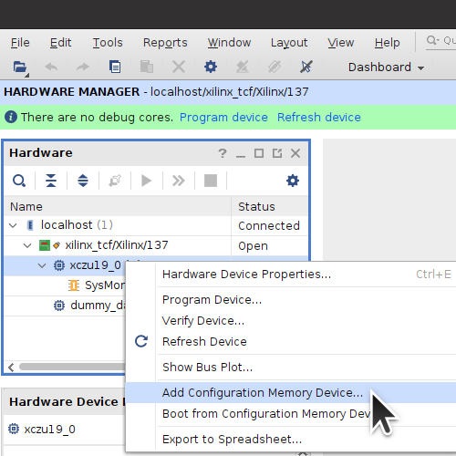

**Work-In-Progress**

# Alveo U25 Debug Log


## Figuring out the JTAG Debug Connector

Initial work was done by *astronomy8* and *victhor393* on the [ServeTheHome Forums](https://forums.servethehome.com/index.php?threads/identifying-some-curious-xilinx-solarflare-cards.35111/). The official [Alveo Programming Cable and Adapter User Guide](https://www.xilinx.com/content/dam/xilinx/support/documents/boards_and_kits/accelerator-cards/ug1377-alveo-programming-cable-user-guide.pdf) is useless.

I began by taking pictures and annotating Config, Reset, and Status pins with pinouts from the [ug1075 Zynq Ultrascale+ Packaging and Pinouts](https://docs.xilinx.com/v/u/en-US/ug1075-zynq-ultrascale-pkg-pinout) guide. Luckily the board was designed with exposed vias for testing.


I then managed to trace the JTAG signals to the Alveo U25 Debug Connector through 22-ohm series resistors and a [SN74AVC4T774](https://www.ti.com/product/SN74AVC4T774)([ZVK Part Marking](https://www.ti.com/packaging/en/docs/partlookup.tsp?partmarking=ZVK)) voltage translating buffer IC.


I traced **PS_PROG_B** and **PS_INIT_B** signals. Also, PS_ERROR_OUT(EO) connects through a [LSF0102](https://www.ti.com/product/LSF0102)([RV Part Marking](https://www.ti.com/packaging/en/docs/partlookup.tsp?partmarking=RV)) voltage translator to the ATSAMD20J16 Pin3.


I created a simple DIY adapter for the U25 Debug Connector using a [MEC8](https://www.samtec.com/products/mec8-113-02-l-d-ra1)([TrustedParts](https://www.trustedparts.com/en/search/MEC8-113-02-L-D-RA1)) connector, [30AWG wire](https://www.digikey.com/en/products/detail/belden-inc/9978-013100/7389141), and a 0.1" Pin Header. See the [AlveoU25_JTAG_Adapter](https://github.com/mwrnd/AlveoU25_JTAG_Adapter) project for progress on the design of an Alveo Debug Connector to JTAG board.


### Alveo U25 Debug Connector Pinout

Note that the JTAG pins run through a voltage translating buffer and operate at 3.3V while the `PS_POR_B` and `PS_INIT_B` signals have direct connections to the Zynq IC and operate at 1.8V so they cannot be driven by the same circuit as the JTAG signals. The operating voltage is the voltage measured on the pad to GND when the board is powered on.

| Pad  | Signal        | Operating Voltage  |
| ---- |:-------------:|:------------------:|
| A1   |  `GND`        |    0V              |
| A2   |  `TCK`        |  3.3V              |
| A3   |  `TDI`        |  3.3V              |
| A4   |  `TMS`        |  3.3V              |
| A5   |  `TDO`        |  3.3V              |
| A6   |  `Vcc`        |  3.3V              |
| A7   |  `GND`        |    0V              |
| A8   |  `???`        |  1.8V              |
| A9   |  `???`        |  1.8V              |
| A10  |  `???`        |  3.3V              |
| A11  |  `???`        |  3.3V              |
| A12  |  `???`        |  3.3V              |
| A13  |  `???`        |  1.8V              |
| B1   |  `GND`        |    0V              |
| B2   |  `PS_POR_B`   |  1.8V              |
| B3   |  `PS_INIT_B`  |  0.1V              |
| B4   |  `???`        |  2.2V              |
| B5   |  `???`        |  0.6V              |
| B6   |  `???`        |  0.6V              |
| B7   |  `GND`        |    0V              |
| B8   |  `???`        |  3.4V (0V-3.4V-0V) |
| B9   |  `???`        |  3.3V              |
| B10  |  `???`        |  1.2V              |
| B11  |  `???`        |  2.5V              |
| B12  |  `???`        |  1.2V              |
| B13  |  `???`        |  0.9V              |


## Config, Reset, and Status Pin States

I measured the voltages on all the Config, Reset, and Status pins.


For the LEDs, D1 (PWR GOOD) is lit Green, D2 is off, D3 (DONE) is off, D4 is lit Yellow, D5 has both Red+Green LEDs lit, D6 has both Red+Blue LEDs lit, and D7 is off.


Measured reset and config voltages when powered:
`PS_DONE` (DN) = 0V
`PS_ERROR_OUT` (EO) = 1.8V
`PS_ERROR_STATUS` (ES) = 0V
`PS_INIT_B` (IN) = 0V
`PS_POR_B` (PR) = 1.8V
`PS_PROG_B` (PG) = 1.8V
`PS_REF_CLK` (RC) = 0.85V
`PS_SRST_B` (SR) = 1.8V
`POR_OVERRIDE` (13) = 0.72V==VCCINT
`PUDC_B` (15) = 1.8V

`POR_OVERRIDE_B` and `PUDC_B` needed to be traced.


## JTAG Access to the Zynq APU


### Attempt to Program Configuration Memory Device

This programming attempt will put the Zynq into a state that will allow further JTAG exploration. The QSPI cannot be programmed over JTAG.

Start Vivado Hardware Manager. Any recent version of [Vivado Lab Edition](https://www.xilinx.com/support/download/index.html/content/xilinx/en/downloadNav/vivado-design-tools/2021-2.html) or full Vivado is enough for this task.

Start a Connection, `Open Target -> Auto Connect`


A *xczu19_0 PL Power Status OFF, cannot connect PL TAP. Check POR_B signal* error shows up when you connect via JTAG.


Right-click on `xczu19_0` and select `Add Configuration Memory Device ...`



Select `mt25qu01g-qspi-x4-single`.


Right click on the `mt25qu01g-qspi-x4-single` and then Program Configuration Memory Device.


Choose any valid U25-related `.bin` and `.elf` files.


Programming fails but it puts the Zynq into a useful state.


Close Target to disconnect Vivado Hardware Manager from the JTAG Adapter.


### xsdb JTAG Access to Zynq

The above attempt to program the Configuration Memory Device should have left the Zynq in a state will now allow `xsdb` access.

Run Xilinx's `xsdb` which comes with Vivado:
```
source /tools/Xilinx/Vivado/2021.2/settings64.sh
xsdb
```

In `xsdb` run `connect`, then `targets`. If things went well, the **APU** should be in the **Power On Reset** state and the first Cortex-A53 should be in the **Reset Catch, EL3(S)/A64** state.

Select the first Cortex-A53 core for communication with `target 9`. `rrd pc` reads the Program Counter Register. All registers can be read with `rrd`. The command `mrd 0xFFD80528 1` reads the `PMU_GLOBAL.CSU_BR_ERR` register which contains the BootROM Error Codes.


The value `80002424` pictured means the current and previous error code was `0x24` which indicates a fault in the QSPI Configuration Memory device.


PMU Register addresses are defined in `/tools/Xilinx/Vitis/2021.2/data/embeddedsw/lib/sw_apps/zynqmp_pmufw/src/pmu_global.h`.
```
#define PMU_GLOBAL_BASEADDR     ((u32)0xFFD80000U)
#define PMU_GLOBAL_REQ_PWRUP_STATUS ((PMU_GLOBAL_BASEADDR)+((u32)0X00000110U))
#define PMU_GLOBAL_ERROR_POR_MASK_1 ((PMU_GLOBAL_BASEADDR)+((u32)0X00000550U))
#define PMU_GLOBAL_CSU_BR_ERROR     ((PMU_GLOBAL_BASEADDR)+((u32)0X00000528U))
```

*Table 11-9* in the [ug1085 Zynq Technical Reference Manual](https://www.xilinx.com/content/dam/xilinx/support/documents/user_guides/ug1085-zynq-ultrascale-trm.pdf) explains the [BootROM Error Codes](https://docs.xilinx.com/r/en-US/ug1085-zynq-ultrascale-trm/CSU-BootROM-Error-Codes) for the `PMU_GLOBAL.CSU_BR_ERR` register.


## QSPI Boot Image Search


## Software and System Setup

**TODO**

[U25 X2 NIC Driver(https://support.lenovo.com/us/en/downloads/ds547997-xilinx-u25-x2-nic-driver-for-unknown-os)] ([4.15.10.1003](https://download.lenovo.com/servers/mig/2020/12/23/43129/xlnx-lnvgy_dd_nic_u25-4.15.10.1003_linux_x86-64.tgz))

[U25 X2 NIC Firmware(https://support.lenovo.com/us/en/downloads/ds548057-xilinx-u25-x2-nic-firmware-for-unknown-os)] ([8.1.3.1011-1](https://download.lenovo.com/servers/mig/2021/01/06/43174/xlnx-lnvgy_fw_nic_u25-8.1.3.1011-1_linux_x86-64.tgz))

[U25 FPGA Utility(https://support.lenovo.com/us/en/downloads/ds547996-xilinx-u25-fpga-utility-for-unknown-os)] ([2.8.372](https://download.lenovo.com/servers/mig/2020/12/23/43128/xlnx-lnvgy_utl_nic_u25-2.8.372_linux_x86-64.tgz))


### Test with Vitis-AI

**TODO**

```
git clone --branch 1.3.2 --recursive --single-branch https://github.com/Xilinx/Vitis-AI.git
cd Vitis-AI
git checkout 1.3.2
git describe --tags

docker pull xilinx/vitis-ai-cpu:1.3.598
./docker_run.sh xilinx/vitis-ai-cpu:1.3.598
```


