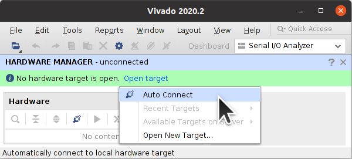

**Work-In-Progress**

# Alveo U25 Debug Log


## Figuring out the JTAG Debug Connector

Initial work was done by *astronomy8* and *victhor393* on the [ServeTheHome Forums](https://forums.servethehome.com/index.php?threads/identifying-some-curious-xilinx-solarflare-cards.35111/). The official [Alveo Programming Cable and Adapter User Guide](https://www.xilinx.com/content/dam/xilinx/support/documents/boards_and_kits/accelerator-cards/ug1377-alveo-programming-cable-user-guide.pdf) is useless.

I began by taking pictures and annotating Config, Reset, and Status pins with pinouts from the [ug1075 Zynq Ultrascale+ Packaging and Pinouts](https://docs.xilinx.com/v/u/en-US/ug1075-zynq-ultrascale-pkg-pinout) guide. Luckily the board was designed with exposed vias for testing.


I then managed to trace the JTAG signals to the Alveo U25 Debug Connector through 22-ohm series resistors and a [SN74AVC4T774](https://www.ti.com/product/SN74AVC4T774)([ZVK Part Marking](https://www.ti.com/packaging/en/docs/partlookup.tsp?partmarking=ZVK)) voltage translating buffer IC.


I traced **PS_PROG_B** and **PS_INIT_B** signals. Also, PS_ERROR_OUT(EO) connects through a [LSF0102](https://www.ti.com/product/LSF0102)([RV Part Marking](https://www.ti.com/packaging/en/docs/partlookup.tsp?partmarking=RV)) voltage translator to the [ATSAMD20J16](https://www.microchip.com/en-us/product/ATSAMD20J16)(Pin3) which acts as a Board Management Controller.


I created a simple DIY adapter for the U25 Debug Connector using a [MEC8](https://www.samtec.com/products/mec8-113-02-l-d-ra1)([TrustedParts](https://www.trustedparts.com/en/search/MEC8-113-02-L-D-RA1)) connector, [30AWG wire](https://www.digikey.com/en/products/detail/belden-inc/9978-013100/7389141), and a 0.1" Pin Header. See the [AlveoU25_JTAG_Adapter](https://github.com/mwrnd/AlveoU25_JTAG_Adapter) project for progress on the design of an Alveo Debug Connector to JTAG board.


### Alveo U25 Debug Connector Pinout

Note that the JTAG pins run through a voltage translating buffer and operate at 3.3V while the `PS_POR_B`, `PS_INIT_B`, `RXD`, and `TXD` signals have direct connections to the Zynq IC and operate at 1.8V so they cannot be driven by the same circuit as the JTAG signals. They require voltage translation. The Operating Voltage is the voltage measured on the pad to GND when the board is powered on.

| Pad  | Signal         | Operating Voltage  |
| ---- |:--------------:|:------------------:|
| A1   | `GND`          |    0V              |
| A2   | `TCK`          |  3.3V              |
| A3   | `TDI`          |  3.3V              |
| A4   | `TMS`          |  3.3V              |
| A5   | `TDO`          |  3.3V              |
| A6   | `3.3V`         |  3.3V              |
| A7   | `GND`          |    0V              |
| A8   | `RXD=PS_MIO22` |  1.8V              |
| A9   | `TXD=PS_MIO23` |  1.8V              |
| A10  | `SDA`          |  3.3V              |
| A11  | `SCL`          |  3.3V              |
| A12  | `nALERT`       |  3.3V              |
| A13  | `1.8V`         |  1.8V              |
| B1   | `GND`          |    0V              |
| B2   | `PS_POR_B`     |  1.8V              |
| B3   | `PS_INIT_B`    |  0.1V              |
| B4   | `???`          |  2.2V              |
| B5   | `???`          |  0.6V              |
| B6   | `???`          |  0.6V              |
| B7   | `GND`          |    0V              |
| B8   | `SFP_PWR`      |  3.4V (0V-3.4V-0V) |
| B9   | `???`          |  3.3V              |
| B10  | `???`          |  1.2V              |
| B11  | `???`          |  2.5V              |
| B12  | `???`          |  1.2V              |
| B13  | `MGTAVCC`      |  0.9V              |


## Config, Reset, and Status Pin States

I measured the voltages on all the Config, Reset, and Status pins.


For the LEDs, D1 (PWR GOOD) is lit Green, D2 is off, D3 (DONE) is off, D4 is lit Yellow, D5 has both Red+Green LEDs lit, D6 has both Red+Blue LEDs lit, and D7 is off.


Measured reset and config voltages when powered:

| Pad                   | Operating Voltage  |
| --------------------- |:------------------:|
|`PS_DONE` (DN)         | 0.0V               |
|`PS_ERROR_OUT` (EO)    | 1.8V               |
|`PS_ERROR_STATUS` (ES) | 0.0V               |
|`PS_INIT_B` (IN)       | 0.0V               |
|`PS_POR_B` (PR)        | 1.8V               |
|`PS_PROG_B` (PG)       | 1.8V               |
|`PS_REF_CLK` (RC)      | 0.85V              |
|`PS_SRST_B` (SR)       | 1.8V               |
|`POR_OVERRIDE` (13)    | 0.72V==VCCINT      |
|`PUDC_B` (15)          | 1.8V               |

`POR_OVERRIDE_B` and `PUDC_B` needed to be traced as well:


## Tracing I2C Signals

I was able to trace the Debug Connector Signals A10, A11, and A12 to SDA, SCL, and nALERT, respectively. They operate at 3.3V. The SCL line has a 4.7k-ohm resistor in series to the [TMP411](https://www.ti.com/product/TMP411) temperature sensor SCL pin.


## Tracing Debug Connector B8

B8 measures 3.4V and connects to the `IN` pin of an [AP2182A](https://www.diodes.com/assets/Datasheets/AP2182A_92A.pdf) 1.5A dual channel current-limited power switch.


The AP2182A's outputs power the SFP Connectors.


The 3.4V rail power cycles every so often.


## Tracing Debug Connector B13

B13 seems to connect to the `MGTAVCC` voltage rail which is used by the FPGA PL (Programmable Logic) SERDES.


## Attempt to Trace B9 Debug Connector Signal


B9 measures 3.3V and has 1k-ohm series resistance to the 3.3V rail. It has 100-ohm series resistance to VccB of the [SN74AUP1T34](https://www.ti.com/lit/ds/symlink/sn74aup1t34.pdf) labeled [`U2`](https://www.ti.com/packaging/en/docs/partlookup.tsp?partmarking=U2), which has a signal that goes to a [NC7NZ34](https://www.onsemi.com/download/data-sheet/pdf/nc7nz34-d.pdf) triple signal buffer IC.


## Attempt to Trace A8 A9 Debug Connector Signals

The pins measure 1.8V. The [U25N Notes](https://xilinx.github.io/U25N-SmartNIC-Solution/docs/build/html/docs/ug1534-shellprogramming.html) mention a UART and [astronomy8 on the ServeTheHome Forum found A8 and A9 are being used](https://forums.servethehome.com/index.php?threads/identifying-some-curious-xilinx-solarflare-cards.35111/post-369295).

After enabling JTAG using the [JTAG Access to the Zynq APU](https://github.com/mwrnd/notes/blob/main/Alveo_U25/debug_log.md#jtag-access-to-the-zynq-apu) procedure I was able to test pins A8 and A9. A8 connects to `PS_MIO22` which is **RXD** and A9 connects to `PS_MIO23` which is **TXD**.


I used a [CH341A](https://github.com/stahir/CH341-Store/tree/5b4fda3add3d492f14f73a8376c580644f6c8195) USB-UART module set to TTL Mode (Pins 2-3 connected) and a 1.8V Adapter.


A fixed-function 1.8V adapter such as one based on a [74ALVC164245](https://assets.nexperia.com/documents/data-sheet/74ALVC164245.pdf) is preferred over a bidrectional voltage translator such as the [TXB0108](https://www.ti.com/lit/ds/symlink/txb0108.pdf).


The UART module reads garbage from both A8 and A9.
```
00000000: 9589 49c2 4c46 b292 9b93 c144 981e 0c90  ..I.LF.....D....
00000010: 6674 0020 c61c 704e cc8c 0818 30c2 8688  ft. ..pN....0...
00000020: dce6 8c22 8492 a5a9 a8a0 2909 55a9 a951  ..."......).U..Q
00000030: 4b41 1291 643b 0328 02ac ab4f 1149 48c3  KA..d;.(...O.IH.
00000040: 0d69 2920 c2db 80c2 3806 49d3 0640 86d7  .i) ....8.I..@..
```

Both A8 and A9 output a constant 1.8V when connected directly to a 1M-ohm input impedance oscilloscope. When also connected to the 1.8V adapter the lines have a voltage bias and very slow rising edges. A pull-up resistor does not help. These are not [open-drain](https://en.wikipedia.org/wiki/Open_collector#Open_drain).


## Tracing SAMD20 Board Controller Reset and Serial Wire Debug SWD

The [SAMD20J16](https://www.microchip.com/en-us/product/ATSAMD20J16)'s [Serial Wire Debug SWD](https://developer.arm.com/documentation/ihi0031/a/The-Serial-Wire-Debug-Port--SW-DP-/Introduction-to-the-ARM-Serial-Wire-Debug--SWD--protocol) pins connect to the B-Side of the Auxiliary Debug Connector.

| Pad  | Signal    | Operating Voltage  |
| ---- |:---------:|:------------------:|
| ...  |  `...`    |   ...              |
| B1   |  `???`    |  3.3V              |
| B2   |  `???`    |  3.3V              |
| B3   |  `SWDIO`  |  3.3V              |
| B4   |  `SWCLK`  |  3.3V              |
| ...  |  `...`    |   ...              |


The [SOT23-3](https://en.wikipedia.org/wiki/Small-outline_transistor#SOT23-3,_SOT323,_SOT416) transistors marked `W4T` are possibly [BSH111BK](https://assets.nexperia.com/documents/data-sheet/BSH111BK.pdf) N-Channel MOSFETs. From the [PBHV8540T](hhttps://web.archive.org/web/20120512162654/http://www.nxp.com/documents/data_sheet/PBHV8540T.pdf) datasheet it appears `W` is a site code and `4T` is the part code. However, the markings [look like Diodes Incorporated markings](https://www.google.com/search?q=%22W4%22+%22Product+Marking%22+site:diodes.com).


I was unable to trace the Reset line to any external connector.


## Attempt to Trace QSPI Signals

I tried tracing the QSPI signals to determine if they can be accessed on the PCB but unfortunately they seem to be routed using buried vias.


## JTAG Access to the Zynq APU


### Attempt to Program Configuration Memory Device

This programming attempt will put the Zynq into a state that will allow further JTAG exploration. The QSPI cannot be programmed over JTAG.

Start Vivado Hardware Manager. Any recent version of [Vivado Lab Edition](https://www.xilinx.com/support/download/index.html/content/xilinx/en/downloadNav/vivado-design-tools/2021-2.html) or full Vivado is enough for this task.

Start a Connection, `Open Target -> Auto Connect`



A *"xczu19_0 PL Power Status OFF, cannot connect PL TAP. Check POR_B signal"* error shows up when you connect via JTAG.


Right-click on `xczu19_0` and select `Add Configuration Memory Device ...`


Select `mt25qu01g-qspi-x4-single`.


Right click on the `mt25qu01g-qspi-x4-single` and then `Program Configuration Memory Device ...`


Choose any valid U25-related `.bin` and `.elf` files.


Programming fails but it puts the Zynq into a useful state.


Close Target to disconnect Vivado Hardware Manager from the JTAG Adapter.


### xsdb JTAG Access to Zynq

The above attempt to program the Configuration Memory Device should have left the Zynq in a state that will now allow `xsdb` access.

Run Xilinx's `xsdb` which comes with Vivado:
```
source /tools/Xilinx/Vivado/2021.2/settings64.sh
xsdb
```

In `xsdb` run `connect`, then `targets`. If things went well, the **APU** should be in the **Power On Reset** state and the first Cortex-A53 should be in the **Reset Catch, EL3(S)/A64** state.

Select the first Cortex-A53 core for communication with `target 9`. `rrd pc` reads the Program Counter Register. Registers can be read all at once with `rrd`. The command `mrd 0xFFD80528 1` reads the `PMU_GLOBAL.CSU_BR_ERR` register which contains the BootROM Error Codes.


The value `80002424` pictured means the current and previous [Error Code](https://docs.xilinx.com/r/en-US/ug1085-zynq-ultrascale-trm/CSU-BootROM-Error-Codes) was `0x24` which indicates a fault in the QSPI Configuration Memory device.


PMU Register addresses are defined in [`/tools/Xilinx/Vitis/2021.2/data/embeddedsw/lib/sw_apps/zynqmp_pmufw/src/pmu_global.h`](https://github.com/Xilinx/embeddedsw/blob/836d748f91eda280bac23d0200df8a3bef61c0c3/lib/sw_apps/zynqmp_pmufw/src/pmu_global.h#L2306).
```
#define PMU_GLOBAL_BASEADDR     ((u32)0xFFD80000U)
#define PMU_GLOBAL_REQ_PWRUP_STATUS ((PMU_GLOBAL_BASEADDR)+((u32)0X00000110U))
#define PMU_GLOBAL_ERROR_POR_MASK_1 ((PMU_GLOBAL_BASEADDR)+((u32)0X00000550U))
#define PMU_GLOBAL_CSU_BR_ERROR     ((PMU_GLOBAL_BASEADDR)+((u32)0X00000528U))
```

*Table 11-9* in the [ug1085 Zynq Technical Reference Manual](https://www.xilinx.com/content/dam/xilinx/support/documents/user_guides/ug1085-zynq-ultrascale-trm.pdf) explains the [BootROM Error Codes](https://docs.xilinx.com/r/en-US/ug1085-zynq-ultrascale-trm/CSU-BootROM-Error-Codes) for the `PMU_GLOBAL.CSU_BR_ERR` register.


### Zynq Boot Halts on Tamper Detection

During a debug attempt, `mrd 0xFFD80528 1` (the [`PMU_GLOBAL.CSU_BR_ERR` register](https://github.com/Xilinx/embeddedsw/blob/836d748f91eda280bac23d0200df8a3bef61c0c3/lib/sw_apps/zynqmp_pmufw/src/pmu_global.h#L2306)) had BootROM [Error Code](https://docs.xilinx.com/r/en-US/ug1085-zynq-ultrascale-trm/CSU-BootROM-Error-Codes) `0x92` as the previous error.


Further exploration did not yield any additional information as the various tamper registers only store the current BootROM Error Code.
```
mrd 0xFFD80528 1
mrd 0xFFCA0018 1
mrd 0xFFCA5000 1
mrd 0xFFCA500C 1
```


## Debug Connector I2C Scanning

I used an [Adafruit MCP2221A](https://www.trustedparts.com/en/part/adafruit/4471) breakout board and [i2c-tools](https://manpages.debian.org/unstable/i2c-tools/i2cdetect.8.en.html).

```
sudo apt-get install i2c-tools
```


On my system the MCP2221 showed up as I2C bus `5`. Use [`i2c-detect`](https://manpages.debian.org/unstable/i2c-tools/i2cdetect.8.en.html) to scan all 7-bit I2C addresses. `0x4D` and `0x4E` are the [TMP411](https://www.ti.com/product/TMP411) temperature sensors [found earlier](#tracing-i2c-signals).
```
lsusb | grep Microchip
sudo i2c-detect -l | grep MCP2221
sudo i2c-detect -r 5 0x03 0x77
```


### I2C Bus Device Register Dumps

Use `i2cdump` on all the devices that were found.


## QSPI Boot Image Search


## Software and System Setup

**TODO**

[U25 X2 NIC Driver](https://support.lenovo.com/us/en/downloads/ds547997-xilinx-u25-x2-nic-driver-for-unknown-os) ([4.15.10.1003](https://download.lenovo.com/servers/mig/2020/12/23/43129/xlnx-lnvgy_dd_nic_u25-4.15.10.1003_linux_x86-64.tgz))

[U25 X2 NIC Firmware](https://support.lenovo.com/us/en/downloads/ds548057-xilinx-u25-x2-nic-firmware-for-unknown-os) ([8.1.3.1011-1](https://download.lenovo.com/servers/mig/2021/01/06/43174/xlnx-lnvgy_fw_nic_u25-8.1.3.1011-1_linux_x86-64.tgz))

[U25 FPGA Utility](https://support.lenovo.com/us/en/downloads/ds547996-xilinx-u25-fpga-utility-for-unknown-os)([2.8.372](https://download.lenovo.com/servers/mig/2020/12/23/43128/xlnx-lnvgy_utl_nic_u25-2.8.372_linux_x86-64.tgz))


### Test with Vitis-AI

**TODO**

```
git clone --branch 1.3.2 --recursive --single-branch https://github.com/Xilinx/Vitis-AI.git
cd Vitis-AI
git checkout 1.3.2
git describe --tags

docker pull xilinx/vitis-ai-cpu:1.3.598
./docker_run.sh xilinx/vitis-ai-cpu:1.3.598
```


