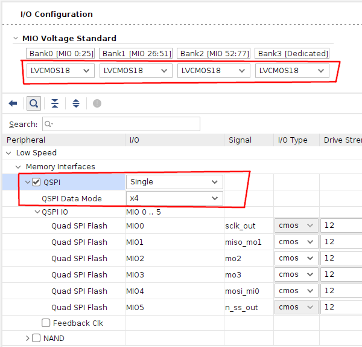

**Work-In-Progress**

# Alveo U25 Vitis Debug Log

Notes for creating a [Vitis](https://www.xilinx.com/products/design-tools/vitis/vitis-platform.html) demo for the U25.


## Zynq MPSoC Hardware Setup in Vivado


The AXI Blocks are assigned the following addresses:


In Vivado the Zynq MPSoC Processing System (PS) block is set up as follows.


DDR4:


Enable QSPI:



Enable UART0:


Export Hardware Platform XSA:

**TODO**


## Zynq MPSoC Software Demo in Vitis

Connect your JTAG Adapter and [UART Adapter with 1.8V Logic Translation](https://github.com/mwrnd/notes/blob/main/Alveo_U25/debug_log.md#attempt-to-trace-a8-a9-debug-connector-signals) to your U25.

Start [`gtkterm`](https://manpages.ubuntu.com/manpages/focal/man1/gtkterm.1.html) or your favorite UART terminal.


Run Vitis from a [terminal](https://ubuntu.com/tutorials/command-line-for-beginners#3-opening-a-terminal).
```
sudo /tools/Xilinx/Vitis/2021.2/bin/vitis
```

Start a new _Application Project_.


Create a New Platform using a Hardware Description XSA File generated in Vivado.


Give it a name.


Target the first core.


Make it a trivial Hello World project.


Open `helloworld.c` and edit the UART output text to loop forever.


Right-click on **Release** in the Assistant and click Build.


Run the following commands in the [XSCT Console](https://docs.xilinx.com/r/en-US/ug1400-vitis-embedded/XSCT-Commands) to enable the Zynq for programming and Debug by getting it out of the `L2 Cache Reset` state.
```
connect
after 10000
targets
targets -set -nocase -filter {name =~ "*APU*"}
mwr 0xffff0000 0x14000000
mask_write 0xFD1A0104 0x501 0x0
targets -set -nocase -filter {name =~ "*A53*#0"}
stop
targets
```


Right-click on **Release** in the Assistant and click Run, Launch Hardware.


Right-click on **Release** in the Assistant and click Run, Debugger.


Wait for the FPGA to program.


Allow Boot Mode overwrite.


For me, the Zynq gets stuck after running the First Stage Boot Loader (FSBL).


Here is the XCST Console output. Explore [Note1](https://support.xilinx.com/s/article/68657?language=en_US), [Note2](https://support.xilinx.com/s/question/0D52E00006hpMMtSAM/possible-to-fix-sd-card-boot-remotely?language=en_US).

```
****** Xilinx Software Commandline Tool (XSCT) v2021.2.0
  **** SW Build 3363252 on 2021-10-14-04:41:01
    ** Copyright 1986-2021 Xilinx, Inc. All Rights Reserved.


xsct% XSDB Server URL: TCP:localhost:36515
xsct% XSDB Server Channel: tcfchan#0
INFO: [Hsi 55-2053] elapsed time for repository (/tools/Xilinx/Vitis/2021.2/data/embeddedsw) loading 0 seconds
Loading the sw platform from /home/user/projects/workspace/u25uart2_wrapper2/platform.spr
Reading the platform  : "u25uart2_wrapper2"
Opening the hardware design, this may take few seconds.
WARNING : No interface that uses file system is available 

/tools/Xilinx/Vitis/2021.2/gnu/microblaze/lin
INFO: Populating the default qemu data for the domain "standalone_psu_cortexa53_0" from the install location /tools/Xilinx/Vitis/2021.2/data/emulation/platforms/zynqmp/sw/a53_standalone/qemu/
attempting to launch hw_server
hw_server

****** Xilinx hw_server v2021.2.0
  **** Build date : Oct  6 2021 at 23:40:43
    ** Copyright 1986-2021 Xilinx, Inc. All Rights Reserved.

INFO: hw_server application started
INFO: Use Ctrl-C to exit hw_server application

INFO: To connect to this hw_server instance use url: TCP:127.0.0.1:3121

connect
tcfchan#2
xsct% targets
  1  PS TAP
     2  PMU
     3  PL
  4  PSU
     5  RPU (Reset)
        6  Cortex-R5 #0 (RPU Reset)
        7  Cortex-R5 #1 (RPU Reset)
     8  APU (L2 Cache Reset)
        9  Cortex-A53 #0 (APU Reset)
       10  Cortex-A53 #1 (APU Reset)
       11  Cortex-A53 #2 (APU Reset)
       12  Cortex-A53 #3 (APU Reset)
xsct% targets -set -nocase -filter {name =~ "*APU*"}
xsct% mwr 0xffff0000 0x14000000
xsct% mask_write 0xFD1A0104 0x501 0x0
xsct% targets -set -nocase -filter {name =~ "*A53*#0"}
xsct% stop
Info: Cortex-A53 #0 (target 9) Stopped at 0xffff0000 (External Debug Request)
xsct% targets
  1  PS TAP
     2  PMU
     3  PL
  4  PSU
     5  RPU (Reset)
        6  Cortex-R5 #0 (RPU Reset)
        7  Cortex-R5 #1 (RPU Reset)
     8  APU
        9* Cortex-A53 #0 (External Debug Request, EL3(S)/A64)
       10  Cortex-A53 #1 (Power On Reset)
       11  Cortex-A53 #2 (Power On Reset)
       12  Cortex-A53 #3 (Power On Reset)
xsct% 
initializing
  0%    0MB   0.0MB/s  ??:?? ETA
  1%    0MB   0.8MB/s  ??:?? ETA
...
 99%   34MB   0.3MB/s  00:00 ETA
100%   34MB   0.3MB/s  01:41    
Info: Cortex-A53 #0 (target 9) Stopped at 0xffff0000 (Reset Catch)
Starting dow

Downloading Program -- /home/user/projects/workspace/u25uart2_wrapper/export/u25uart2_wrapper/sw/u25uart2_wrapper/boot/fsbl.elf
	section, .text: 0xfffc0000 - 0xfffcafc7
	section, .note.gnu.build-id: 0xfffcafc8 - 0xfffcafeb
	section, .init: 0xfffcb000 - 0xfffcb033
	section, .fini: 0xfffcb040 - 0xfffcb073
	section, .rodata: 0xfffcb080 - 0xfffcb4cf
	section, .sys_cfg_data: 0xfffcb500 - 0xfffcbcbf
	section, .mmu_tbl0: 0xfffcc000 - 0xfffcc00f
	section, .mmu_tbl1: 0xfffcd000 - 0xfffcefff
	section, .mmu_tbl2: 0xfffcf000 - 0xfffd2fff
	section, .data: 0xfffd3000 - 0xfffd41df
	section, .sbss: 0xfffd41e0 - 0xfffd41ff
	section, .bss: 0xfffd4200 - 0xfffd58bf
	section, .heap: 0xfffd58c0 - 0xfffd5cbf
	section, .stack: 0xfffd5cc0 - 0xfffd7cbf
	section, .dup_data: 0xfffd7cc0 - 0xfffd8e9f
	section, .handoff_params: 0xfffe9e00 - 0xfffe9e87
	section, .bitstream_buffer: 0xffff0040 - 0xfffffc3f

  0%    0MB   0.0MB/s  ??:?? ETA
 19%    0MB   0.0MB/s  ??:?? ETA
 39%    0MB   0.0MB/s  ??:?? ETA
 59%    0MB   0.0MB/s  ??:?? ETA
 79%    0MB   0.0MB/s  ??:?? ETA
 99%    0MB   0.0MB/s  00:00 ETA
100%    0MB   0.0MB/s  00:03    
Setting PC to Program Start Address 0xfffc0000
Successfully downloaded /home/user/projects/workspace/u25uart2_wrapper/export/u25uart2_wrapper/sw/u25uart2_wrapper/boot/fsbl.elf
Finished dow
Info: Breakpoint 0 status:
   target 9: {Address: 0xfffc82e4 Type: Hardware}
xsct% Info: Cortex-A53 #0 (target 9) Running
Info: Cortex-A53 #0 (target 9) Stopped at 0xffff0000 (Reset Catch)
Starting dow

Downloading Program -- /home/user/projects/workspace/test/Release/test.elf
	section, .text: 0x00000000 - 0x000014b3
	section, .init: 0x000014c0 - 0x000014f3
	section, .fini: 0x00001500 - 0x00001533
	section, .rodata: 0x00001538 - 0x000015a7
	section, .rodata1: 0x000015a8 - 0x000015bf
	section, .sdata2: 0x000015c0 - 0x000015bf
	section, .sbss2: 0x000015c0 - 0x000015bf
	section, .data: 0x000015c0 - 0x00001d77
	section, .data1: 0x00001d78 - 0x00001d7f
	section, .note.gnu.build-id: 0x00001d80 - 0x00001da3
	section, .ctors: 0x00001da4 - 0x00001dbf
	section, .dtors: 0x00001dc0 - 0x00001dbf
	section, .eh_frame: 0x00001dc0 - 0x00001dc3
	section, .mmu_tbl0: 0x00002000 - 0x0000200f
	section, .mmu_tbl1: 0x00003000 - 0x00004fff
	section, .mmu_tbl2: 0x00005000 - 0x00008fff
	section, .preinit_array: 0x00009000 - 0x00008fff
	section, .init_array: 0x00009000 - 0x00009007
	section, .fini_array: 0x00009008 - 0x00009047
	section, .sdata: 0x00009048 - 0x0000907f
	section, .sbss: 0x00009080 - 0x0000907f
	section, .tdata: 0x00009080 - 0x0000907f
	section, .tbss: 0x00009080 - 0x0000907f
	section, .bss: 0x00009080 - 0x000090bf
	section, .heap: 0x000090c0 - 0x0000b0bf
	section, .stack: 0x0000b0c0 - 0x0000e0bf


  0%    0MB   0.0MB/s  ??:?? ETA
 19%    0MB   0.0MB/s  ??:?? ETA
 39%    0MB   0.0MB/s  ??:?? ETA
 59%    0MB   0.0MB/s  ??:?? ETA
 79%    0MB   0.0MB/s  ??:?? ETA
 99%    0MB   0.0MB/s  00:00 ETA
100%    0MB   0.0MB/s  00:03    
Setting PC to Program Start Address 0xfffc0000
Successfully downloaded /home/user/projects/workspace/u25uart2_wrapper/export/u25uart2_wrapper/sw/u25uart2_wrapper/boot/fsbl.elf
Finished dow
Info: Breakpoint 0 status:
   target 9: {Address: 0xfffc82e4 Type: Hardware}
xsct% Info: Cortex-A53 #0 (target 9) Running
Info: Cortex-A53 #0 (target 9) Stopped at 0xffff0000 (Reset Catch)
Starting dow

Downloading Program -- /home/user/projects/workspace/test/Release/test.elf
	section, .text: 0x00000000 - 0x000014b3
	section, .init: 0x000014c0 - 0x000014f3
	section, .fini: 0x00001500 - 0x00001533
	section, .rodata: 0x00001538 - 0x000015a7
	section, .rodata1: 0x000015a8 - 0x000015bf
	section, .sdata2: 0x000015c0 - 0x000015bf
	section, .sbss2: 0x000015c0 - 0x000015bf
	section, .data: 0x000015c0 - 0x00001d77
	section, .data1: 0x00001d78 - 0x00001d7f
	section, .note.gnu.build-id: 0x00001d80 - 0x00001da3
	section, .ctors: 0x00001da4 - 0x00001dbf
	section, .dtors: 0x00001dc0 - 0x00001dbf
	section, .eh_frame: 0x00001dc0 - 0x00001dc3
	section, .mmu_tbl0: 0x00002000 - 0x0000200f
	section, .mmu_tbl1: 0x00003000 - 0x00004fff
	section, .mmu_tbl2: 0x00005000 - 0x00008fff
	section, .preinit_array: 0x00009000 - 0x00008fff
	section, .init_array: 0x00009000 - 0x00009007
	section, .fini_array: 0x00009008 - 0x00009047
	section, .sdata: 0x00009048 - 0x0000907f
	section, .sbss: 0x00009080 - 0x0000907f
	section, .tdata: 0x00009080 - 0x0000907f
	section, .tbss: 0x00009080 - 0x0000907f
	section, .bss: 0x00009080 - 0x000090bf
	section, .heap: 0x000090c0 - 0x0000b0bf
	section, .stack: 0x0000b0c0 - 0x0000e0bf

  0%    0MB   0.0MB/s  ??:?? ETA
aborting, 2 pending requests... 
aborting, 1 pending requests... 
Failed to download /home/user/projects/workspace/test/Release/test.elf
Info: Cortex-A53 #0 (target 9) Stopped at 0x0 (Cannot resume. Cannot read 'pc'. Cannot read 'r0'. Cortex-A53 #0: EDITR not ready)
xsct% 

xsct% mrd 0x80000000 16
Memory read error at 0x80000000. Cannot read sctlr_el3. Cannot read r0. Cortex-A53 #0: EDITR not ready

xsct% mrd 0xFFD80528 1
Memory read error at 0xFFD80528. Cannot read sctlr_el3. Cannot read r0. Cortex-A53 #0: EDITR not ready

```

