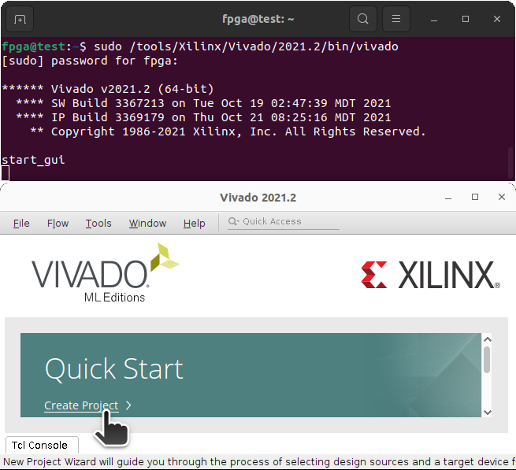
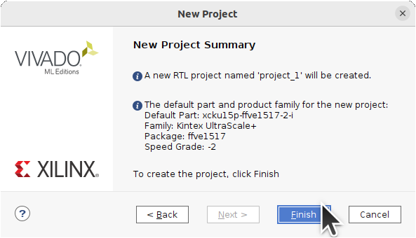
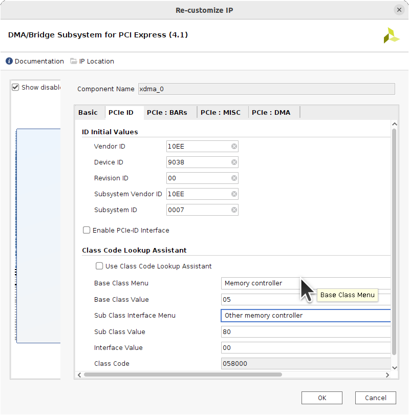
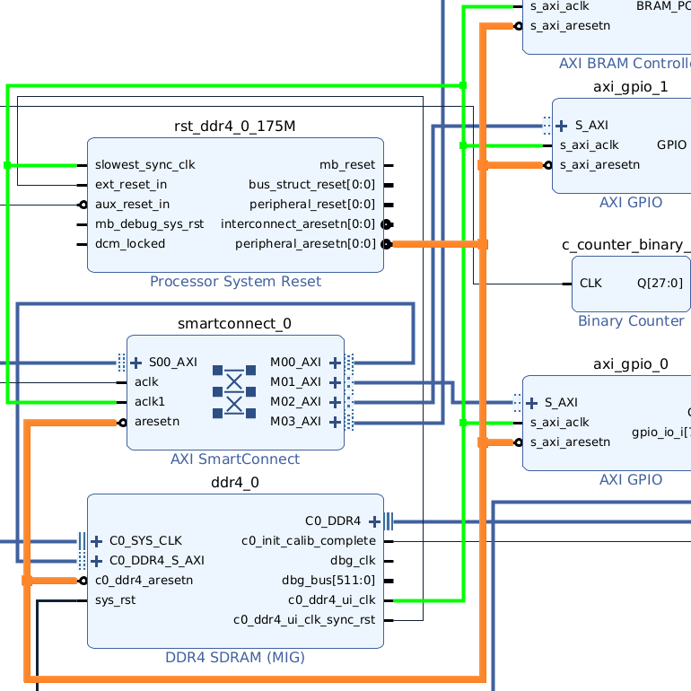
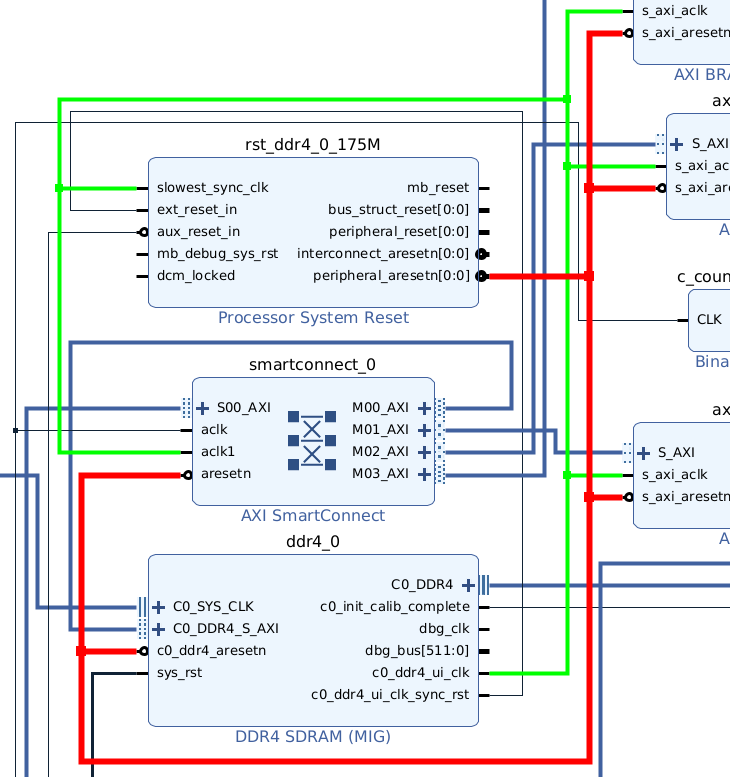
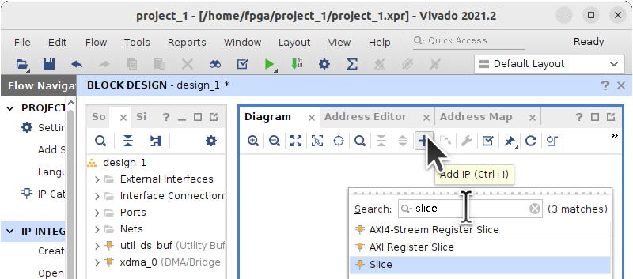
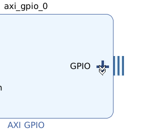

# Vivado XDMA and DDR Memory Project

This tutorial goes through the steps of generating a basic XDMA and DDR4 Block Diagram Design in Vivado for the XCKU15P FPGA in the Innova-2.

Under Linux, start Vivado with:
```
sudo /tools/Xilinx/Vivado/2021.2/bin/vivado
```

*Create Project*


Choose directory and project name.


No source files are needed to start.


Select the target FPGA, in this case the `xcku15p-ffve1517-2-i`.


Project Summary.


Click on **Create Block Design** in the Flow Navigator and give it a name.


## Add XDMA

In the Diagram editor window, click **Add IP** and search for `xdma`. Double-click **DMA/Bridge Subsystem for PCI Express**.


Under the *Basic* tab in XDMA Customization, choose **X0Y2** as the *PCIe Block Location*, **X8** as the *Lane Width*, **8.0 GT/s** as the *Maximum Link Speed*, and **AXI Memory Mapped** as the *DMA Interface Option*. The actual pins are defined later. This selects which PCIe Block will be controlling the Gigabit SERDES Transceivers. All other options can be left at their defaults.


Under the *PCIe ID* tab, choose **Memory controller** as the *Base Class Menu* and **Other memory controller** as the *Sub Class Interface Menu*.


Under the *Miscellaneous* tab, uncheck *Configuration Management Interface* to disable it.


Under the *DMA* tab, select **4** as the number of DMA Read and Write Channels. Click *OK* to update the design in the Block Diagram.


Click *Run Block Automation* in the Diagram editor.


Choose the same options as earlier for the **IP Level** design; **X8**, **8.0 GT/s**, **AXI Memory Mapped**, **4** Read and Write Channels.


Block Automation will generate an appropriate buffer for the clock and add external signals.


## Add AXI

In the Diagram editor window, click **Add IP** and search for `axi smart`. Double-click **AXI SmartConnect**. SmartConnect automates clock and reset connections between AXI **S**lave and **M**aster devices and communication among them.


This design will require 1 **S**lave interface, 4 **M**aster interfaces, 2 clock inputs, and 1 asynchronous reset.


Connect the XDMA and AXI SmartConnect blocks in the Diagram Editor. **M_AXI** to **S00_AXI**, **axi_clk** to **aclk**, and **axi_aresetn** to **aresetn**.


## Add DDR4

In the Diagram editor window, click **Add IP** and search for `ddr4`. Double-click **DDR4 SDRAM (MIG)**. This is the DDR4 Memory Interface Generator.


Under the *Basic* tab in DDR4 Customization, write **1428** as the *Memory Device Interface Speed (ps)*, choose **9996 (100.04MHz)** as the *Reference Input Clock Speed (ps)*, choose `MT40A1G16WBU-083E` as the *Memory Part*, choose **64** as the *Data Width*, and **DM NO DBI** as the *Data Mask and DBI*. `1428ps=700MHz=1400MT` is the slowest speed possible for DDR4 and a 64-bit width prevents ECC from being enabled. This is meant to be used for basic functionality testing. Note parts rated to `-083E` should be able to handle up to `938ps=1333MHz=2666MT`.


Under the *AXI Options* tab, choose *Round Robin* as the Arbitration Scheme. Leave all other options at their defaults. Click *OK* to continue.


Click *Run Connection Automation* in the Diagram editor.


Select all the ports for automatic connection.


This will generate a [*Processor System Reset* Block](???) that controls the Active-Low Asynchronous Reset (*aresetn*) for the design.


Connect the DDR4 User Interface Clock (*c0_ddr4_ui_clk*) to AXI SmartConnect *aclk1*. This will be the slowest clock in the design.


Block automation generated a System Reset (*sys_rst*) for the DDR4 Block but the Innova-2 does not have such a signal.


Delete the DDR4 System Reset (*sys_rst*) signal and port (*reset_rtl_0_0*). A DDR4 reset signal will be added next.


In the Diagram editor window, click **Add IP** and search for `vector`. Double-click **Utility Vector Logic** to add a basic inverter gate.


Choose a bit width (*C_SIZE*) of **1** and the *C_OPERATION* as **not**.


Invert the the PCIe Reset Signal (*reset_rtl_0*) and connect it to the DDR4 System Reset (*sys_rst*). PCIe Reset is Active-Low while DDR4 Reset is Active-High. Both blocks are thus enabled when the board is powered-on and PCIe activated.


## Add Blinking XDMA Status LED

In the Diagram editor window, click **Add IP** and search for `counter`. Double-click **Binary Counter**. This counter will connect to the XDMA Clock and blink an LED about once per second.


Set the *Output Width* as **28**. XDMA uses a 250MHz clock so `250000000/(2^28)~=0.9313Hz`


Connect the counter *CLK* input to XDMA *axi_aclk*.


Only the 28th bit will be needed for the Status LED. In the Diagram editor window, click **Add IP** and search for `slice`. Double-click **Slice**. This block selects specified bits from wider bus arrays.


Customize the Slice Block to output the last bit, **27**, from the 28-Bit Wide input.


Connect the Counter Output (*Q[27:0]*) to Slice Input (*Din[27:0]*). Note the widths match.


Right-click on the Slice *Dout[0:0]* output and choose **Make External**. This will create an external port for the blinking XDMA Status LED.


## Add GPIO Input for Internal Status Signals

In the Diagram editor window, click **Add IP** and search for `gpio`. Double-click **AXI GPIO**. This will be used to read status signals over AXI.


Customize the GPIO for *All Inputs* with a *GPIO Width* of **8**.


Most status-related signals in the design are single wires while the GPIO Block expects a bus. In the Diagram editor window, click **Add IP** and search for `concat`. Double-click **Concat** to allow concatenating individual signals into a bus.


Customize the Concat Block into eight 1-Bit wide inputs.


Click the Plus Sign on the GPIO Block to expand the signal port.


Connect the Concat Output (*dout[7:0]*) to the GPIO Input (*gpio_io_i[7:0]*).


Connect the XDMA Link Up signal (*user_lnk_up*) to the Concat block. This is useless as XDMA must be working to access the GPIO but it is a simple sanity check.


Connect the DDR4 Calibration Complete signal (*c0_init_calib_complete*) to the Concat block.


Connect the GPIO Block (*S_AXI*) to the SmartConnect Block (*M01_AXI*). Use SmartConnect *aclk1* for *axi_aclk* and SmartConnect *aresetn* for *axi_aresetn*.


## Add GPIO Output for a Controllable LED

In the Diagram editor window, click **Add IP** and search for `gpio`. Double-click **AXI GPIO**.


Customize the GPIO for *All Outputs* with a *GPIO Width* of **1**. Set the *Default Output Value* to `0x00000000`. The Innova-2 has inverted LED outputs which means the LED will be ON with a value of 0.


Right-click on *GPIO* and choose *Make External*. Vivado should generate a *GPIO_0* port.


Connect the GPIO Block (*S_AXI*) to the SmartConnect Block (*M02_AXI*). Use SmartConnect *aclk1* for *axi_aclk* and SmartConnect *aresetn* for *axi_aresetn*.


## Add GPIO Output for a Controllable LED

In the Diagram editor window, click **Add IP** and search for `axi bram`. Double-click **AXI BRAM Controller**. BRAM is FPGA Fabric Memory and is useful functionality check.


Customize the BRAM Controller to a *Data Width* of **1024** and **1** *BRAM Interfaces*.


Connect the BRAM Controller Block (*S_AXI*) to the SmartConnect Block (*M03_AXI*). Use SmartConnect *aclk1* for *axi_aclk* and SmartConnect *aresetn* for *axi_aresetn*.


Run Connection Automation.


It should generate a Block Memory Generator Block.


The Block Design is now complete. Note all the AXI Blocks use the DDR4 User Interface Clock. At 100MHz it is slower than the 250MHz XDMA Clock. This makes it easier to meet timing constraints.


## Define AXI Addresses

Open the Address Editor tab. Right-click and choose *Assign All*. These are the addresses at which the AXI Blocks will be accessed. Make sure there are no overlaps.


## Validate the Design

Back in the Diagram editor, click *Validate Design*.


This should take about a minute and complete with no errors.


## Add Signal Pin Constraints

Open the Sources tab and click *Add Sources*. If you already have a constraints file then add it here.


*Add or create constraints*


*Create File*


Create an XDC (Xilinx Design Constraints) file.


Finish Constraints File Creation.


Double-click the file to open the text editor.


Add Memory Configuration constraints for the bitstream file.


Note all the external signal ports in the Block diagram. Read left-to-right. Left side has system inputs. Right side has system outputs and bidirectional IO.


Add PCIe constraints. Rename signals to match the Block design names if necessary. Different versions of Vivado use different default names.


Add GPIO and LED constraints. The Innova-2 has two LEDs. One is connected to a prescaled clock and the other to a GPIO Block for user control over XDMA.


Add DDR4 constraints.


## Create HDL Wrapper

In the Sources tab, right-click on the Block Design file and select *HDL Wrapper*.


Allow Vivado to create and manage the HDL Wrapper. This is the top-level HDL file associated with the design and must be included in every project.


The HDL wrapper file will appear in the project's design hierarchy.


## Synthesize and Implement

Click *Generate Bitstream* which will Synthesize and Implement the Block design.


