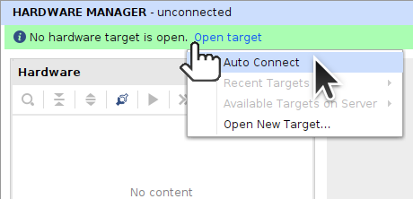

** Work-In-Progress **

The Xilinx [Kria](https://www.xilinx.com/products/som/kria.html) [KV260](https://www.xilinx.com/products/som/kria/kv260-vision-starter-kit.html) is based on the [XCK26](https://www.xilinx.com/products/silicon-devices/soc/zynq-ultrascale-mpsoc.html#eg) ([rebranded XCZU5EV-SFVC784-2LV-C](https://en.wikipedia.org/w/index.php?title=List_of_Xilinx_FPGAs&oldid=1129244401#Alveo_and_Kria)).

This tutorial is for a simple Blinking LED PL (Programmable Logic) project with minimal PS (Processing System) functionality.

## PMOD Connector

For the [PMOD](https://digilent.com/reference/pmod/start) Connector, HDA11(H12) and HDA15(B10) are filtered. Pins HDA12(E10), HDA13(D10), HDA14(C11), HDA16_CC(E12), HDA17(D11), HDA18(B11) are not. Refer to [constraints_kv260.xdc](constraints_kv260.xdc) for the pin definitions.

## Design

### Add Zynq MPSoC

Add the [Zynq MPSoC IP](https://www.xilinx.com/content/dam/xilinx/support/documents/ip_documentation/zynq_ultra_ps_e/v3_4/pg201-zynq-ultrascale-plus-processing-system.pdf) to the Block Design. Refer to the [Embedded Design Tutorial](https://xilinx.github.io/Embedded-Design-Tutorials/docs/2021.1/build/html/docs/Introduction/ZynqMPSoC-EDT/3-system-configuration.html)

### Export Hardware for Vitis

Export Hardware Platform.

Select *Hardware* as the platform.

Name it.

This is a pre-synthesis project.

This is a pre-synthesis project.

Use `1.0` for the version.

Finish creation of the Hardware Platform.

## Program the Zynq in Hardware Manager

In Hardware Manager, *Open Target* then *Auto Connect*.

Right-click on `xck26_0` and *Program Device*.

Program the Device using the generated Bitstream.

Run `xsct` and `loadhw` the [XSA](https://docs.xilinx.com/r/en-US/ug1400-vitis-embedded/Creating-a-Hardware-Design-XSA-File) Archive.

## Create Boot Image in Vitis

Create Boot Image in Vitis

