# XDMA Communication

Tutorial for an [XDMA](https://docs.xilinx.com/r/en-US/pg195-pcie-dma/Introduction)-based peripheral FPGA design using [dma_ip_drivers](https://github.com/xilinx/dma_ip_drivers).


# Table of Contents

   * [Software Access to Memory-Mapped Blocks](#software-access-to-memory-mapped-blocks)
      * [M_AXI](#m_axi)
      * [M_AXI_LITE](#m_axi_lite)
   * [Software Access to AXI Stream Blocks](#software-access-to-axi-stream-blocks)
   * [Creating a Memory-Mapped XDMA Block Diagram Design](#creating-a-memory-mapped-xdma-block-diagram-design)
   * [Creating an AXI4-Stream XDMA Block Diagram Design](#creating-an-axi4-stream-xdma-block-diagram-design)
   * [Recreating a Project from a Tcl File](#recreating-a-project-from-a-tcl-file)
   * [Porting the Design to Another FPGA](#porting-the-design-to-another-fpga)
   * [Install XDMA Driver from dma_ip_drivers](#install-xdma-driver-from-dma_ip_drivers)
   * [Useful Links](#useful-links)


## QuickStart

PCI Express is a [Layered Protocol](https://en.wikipedia.org/wiki/Protocol_stack). With the [XDMA Driver (*dma_ip_drivers*)](https://github.com/xilinx/dma_ip_drivers) running on the host PC and an [XDMA IP Block](https://docs.xilinx.com/r/en-US/pg195-pcie-dma/Introduction) in your FPGA project, you operate at the Application layer. You read from and write to what appears as a file but it accesses the AXI Bus in your FPGA project. The XDMA Driver and XDMA IP Block handle the lower layers.

The XDMA driver creates [character device files](https://en.wikipedia.org/wiki/Device_file#Character_devices) for access to an AXI Bus. For DMA transfers to **M_AXI** blocks, `/dev/xdma0_h2c_0` is Write-Only and `/dev/xdma0_c2h_0` is Read-Only. To read from an AXI Block at address `0x12345000` you would read from address `0x12345000` of the `/dev/xdma0_c2h_0` (Card-to-Host) file. To write you would write to the appropriate address of the `/dev/xdma0_h2c_0` (Host-to-Card) file. For single word (32-Bit) register-like reads and writes to **M_AXI_LITE** blocks, `/dev/xdma0_user` is Read-Write. 

[`pread`/`pwrite`](https://manpages.ubuntu.com/manpages/jammy/en/man2/pread.2.html) combine [`lseek`](https://manpages.ubuntu.com/manpages/jammy/en/man2/lseek.2.html) and [`read`/`write`](https://manpages.ubuntu.com/manpages/jammy/en/man2/read.2.html). Note the Linux Kernel has a [write limit](https://manpages.ubuntu.com/manpages/focal/en/man2/write.2.html) of `0x7FFFF000=2147479552` bytes per call.
```C
#include <unistd.h>

ssize_t pread(int fd, void *buf, size_t count, off_t offset);
ssize_t pwrite(int fd, const void *buf, size_t count, off_t offset);
```


## Software Access to Memory-Mapped Blocks

See [Creating a Memory-Mapped XDMA Block Diagram Design](#creating-a-memory-mapped-xdma-block-diagram-design) below for instructions to re create the simple included demo, [`xdma_mm.tcl`](xdma_mm.tcl). It can also be [retargeted to other FPGAs and/or boards](#recreating-a-project-from-a-tcl-file). [Configuration bitstreams are available](https://github.com/mwrnd/notes/releases/v0.1.0/) for the [Innova-2](https://github.com/mwrnd/innova2_flex_xcku15p_notes).


### M_AXI

The **M_AXI** interface is for Direct Memory Access (DMA) to AXI blocks.

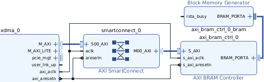

The [BRAM Controller Block](https://docs.xilinx.com/v/u/en-US/pg078-axi-bram-ctrl) attached to the interface has an address of `0xC0000000` and a size of 8KB (smallest that will consistently work). You can increase the *Size*/*Range* up to the maximum that Vivado will successfully implement based on your FPGA's resources.

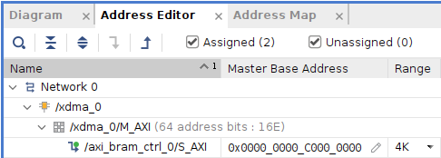

The following is some minimal C code without error checking. Observe the `buffer` is defined as an array of [32-Bit unsigned integers (`uint32_t`)](https://manpages.ubuntu.com/manpages/trusty/en/man7/stdint.h.7posix.html) and is used as such but `pread`/`pwrite` operate on bytes, hence the `#define`s for `DATA_BYTES` and `DATA_WORDS`. `/dev/xdma0_h2c_0` (Host-to-Card) is opened as Write-Only ([`O_WRONLY`](https://manpages.ubuntu.com/manpages/trusty/en/man2/open.2.html)). `/dev/xdma0_c2h_0` (Card-to-Host) is opened as Read-Only ([`O_RDONLY`](https://manpages.ubuntu.com/manpages/trusty/en/man2/open.2.html)).
```C
#define DATA_BYTES    8192
#define DATA_WORDS    (DATA_BYTES/4)

uint32_t buffer[DATA_WORDS];
uint64_t address = 0xC0000000;
ssize_t rc;

// Fill the buffer with data
for (int i = 0; i < DATA_WORDS; i++) { buffer[i] = (DATA_WORDS - i); }

printf("Buffer Contents before H2C write: \n");
printf("[0]=%04d, [4]=%04d, [%d]=%04d\n",
        (uint32_t)buffer[0], (uint32_t)buffer[4],
        (DATA_WORDS - 3), (uint32_t)buffer[(DATA_WORDS - 3)]);

// Open M_AXI H2C Host-to-Card Device as Write-Only
int xdma_h2cfd = open("/dev/xdma0_h2c_0", O_WRONLY);

// Write the full buffer to the FPGA design's BRAM
rc = pwrite(xdma_h2cfd, buffer, DATA_BYTES, address);

// Clear the buffer to make sure data was read from FPGA
printf("\nClearing buffer.\n");
for (int i = 0; i < DATA_WORDS ; i++) { buffer[i] = 0; }

// Open M_AXI C2H Card-to-Host Device as Read-Only
int xdma_c2hfd = open("/dev/xdma0_c2h_0", O_RDONLY);

// Read the full buffer from the FPGA design's BRAM
rc = pread(xdma_c2hfd, buffer, DATA_BYTES, address);

printf("\nBuffer Contents after C2H read: \n");
printf("[0]=%04d, [4]=%04d, [%d]=%04d\n",
        (uint32_t)buffer[0], (uint32_t)buffer[4],
        (DATA_WORDS - 3), (uint32_t)buffer[(DATA_WORDS-3)]);

printf("\nrc = %ld = bytes read from FPGA's BRAM\n", rc);

close(xdma_h2cfd);
close(xdma_c2hfd);
```

[`mm_axi_test.c`](mm_axi_test.c) contains the above in a full C program.

```
gcc -Wall mm_axi_test.c -o mm_axi_test
sudo ./mm_axi_test
```

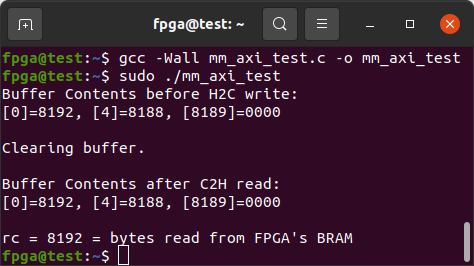


### M_AXI_LITE

The **M_AXI_LITE** interface is useful for single word access to register-like blocks as communication is via single Transaction Layer Packet (TLP) requests.

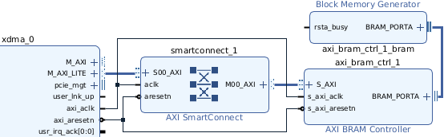

The [BRAM Controller Block](https://docs.xilinx.com/v/u/en-US/pg078-axi-bram-ctrl) attached to the interface has an address of `0x40010000` and a size of 8KB (smallest that will consistently work). You can increase the *Size*/*Range* up to the maximum that Vivado will successfully implement based on your FPGA's resources.

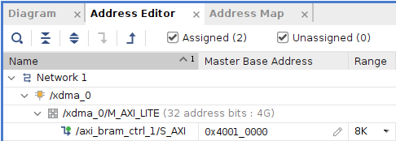

The XDMA Block in the example is [set up with a PCIe to AXI Translation offset](#add-xdma-block) of `0x40000000` which must be subtracted from the intended AXI address. It is safest to leave the offset at `0` in your designs but useful to be aware of if you are working with other's projects.

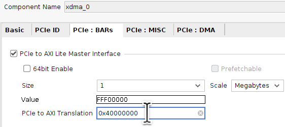

The following is some minimal C code without error checking. Note `count=4` is fixed for `pread`/`pwrite` as each `M_AXI_LITE` TLP transaction consists of a 32-bit=4-byte data word. `/dev/xdma0_user` is opened Read-Write ([`O_RDWR`](https://manpages.ubuntu.com/manpages/trusty/en/man2/open.2.html)) as it is designed for low throughput control data.
```C
// Open M_AXI_LITE Device as Read-Write
int xdma_userfd = open("/dev/xdma0_user", O_RDWR);

#define XDMA_PCIe_to_AXI_Translation_Offset 0x40000000
uint64_t address = 0x40010000 - XDMA_PCIe_to_AXI_Translation_Offset;
uint32_t data_word = 0xAA55A55A;
ssize_t rc;

rc = pwrite(xdma_userfd, &data_word, 4, address);

data_word = 0;

rc = pread(xdma_userfd, &data_word, 4, address);

printf("AXILite Address 0x%08lX after offset has data: 0x%08X",
        address, data_word);
printf(", rc = %ld\n", rc);

close(xdma_userfd);
```

[`mm_axilite_test.c`](mm_axilite_test.c) contains the above in a full C program.

```
gcc -Wall mm_axilite_test.c -o mm_axilite_test
sudo ./mm_axilite_test
```

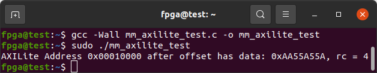


## Software Access to AXI Stream Blocks

**AXI4-Stream** is designed for continuous throughput. Multiples of the `tdata` width (64-Bits for this demo) up to the [Stream](https://docs.xilinx.com/r/en-US/pg085-axi4stream-infrastructure/AXI4-Stream-Data-FIFO?tocId=gyNUSa81sSudIrD3MNZ6aw) [FIFO](https://en.wikipedia.org/wiki/FIFO_(computing_and_electronics)) depth need to be read from C2H (Card-to-Host) or written to H2C (Host-to-Card).

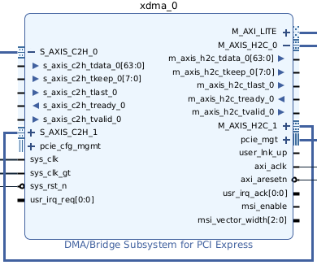

See [Creating an AXI4-Stream XDMA Block Diagram Design](#creating-an-axi4-stream-xdma-block-diagram-design) below for instructions to recreate the simple included demo, [`xdma_stream.tcl`](xdma_stream.tcl). It can also be [retargeted to other FPGAs and/or boards](#recreating-a-project-from-a-tcl-file). [Configuration bitstreams are available](https://github.com/mwrnd/notes/releases/v0.1.0/) for the [Innova-2](https://github.com/mwrnd/innova2_flex_xcku15p_notes).

Each pair of input (H2C) floating-point values is multiplied to an output (C2H) floating-point value. To account for FIFOs built into the AXI4-Stream blocks, 16 floats (64-bytes) are sent and 8 are received. Data is sent and received to address `0` as it is a stream. The data stream sinks into **S_AXIS_C2H_?** and flows from **M_AXIS_H2C_?** interfaces. Check out the [xdma_stream_512bit](https://github.com/mwrnd/innova2_experiments/tree/main/xdma_stream_512bit) project for a more complex demonstration.

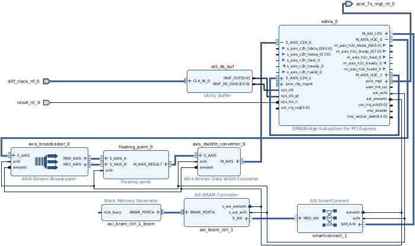

```C
#define DATA_SIZE 64
#define H2C_FLOAT_COUNT (DATA_SIZE / 4)
#define C2H_FLOAT_COUNT (H2C_FLOAT_COUNT / 2)

float h2c_data[H2C_FLOAT_COUNT];
float c2h_data[C2H_FLOAT_COUNT];
ssize_t rc = 0;

int xdma_fd_wrte = open("/dev/xdma0_h2c_0", O_WRONLY);
int xdma_fd_read = open("/dev/xdma0_c2h_0", O_RDONLY);

printf("H2C_FLOAT_COUNT = %d, C2H_FLOAT_COUNT = %d\n",
        H2C_FLOAT_COUNT, C2H_FLOAT_COUNT);

// fill the write data buffer with floating point values
for (int i = 0; i < H2C_FLOAT_COUNT; i++) { h2c_data[i]=(3.14*(i+1)); }


// write data buffer to the AXI Stream - a float is 4-bytes
rc = pwrite(xdma_fd_wrte, h2c_data, (H2C_FLOAT_COUNT * 4), 0);
printf("Write returned rc = %ld = number of bytes sent\n", rc);

// read data from the AXI Stream into buffer - a float is 4-bytes
rc = pread (xdma_fd_read, c2h_data, (C2H_FLOAT_COUNT * 4), 0);
printf("Read  returned rc = %ld = number of bytes received\n", rc);


// print the data in the return data (C2H) buffer
uint32_t j = 0;
float expected = 0;
printf("\n");
for (int i = 0 ; i < H2C_FLOAT_COUNT; i=i+2)
{
    j = floor((i / 2));
    printf("%-2d, %-2d, h2c[%02d]*[%02d]=c2h[%02d] = %f*%f = %f",
            i, j, i, (i+1), j, h2c_data[i], h2c_data[(i+1)], c2h_data[j]);
    if (fabs((h2c_data[i] * h2c_data[(i+1)]) - c2h_data[j]) > 0.01)
    {
        expected = (h2c_data[i] * h2c_data[(i+1)]);
        printf(" -- ERROR, was expecting %f", expected);
    }
    printf("\n");
}

close(xdma_fd_wrte);
close(xdma_fd_read);
```

[`stream_test.c`](stream_test.c) contains the above in a full C program.
```
gcc -Wall stream_test.c -o stream_test -lm
sudo ./stream_test
```

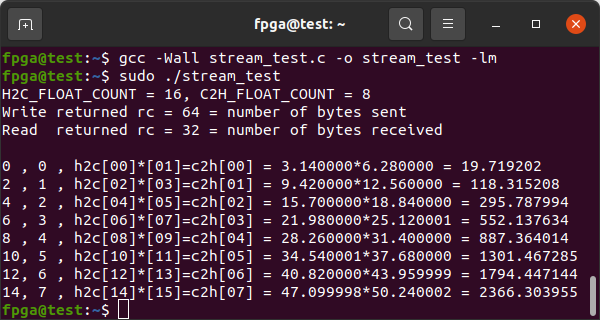


## Creating a Memory-Mapped XDMA Block Diagram Design

This procedure will recreate the design in [`xdma_mm.tcl`](xdma_mm.tcl), which can also be `source`'ed in Vivado and [retargeted to other FPGAs and/or boards](#recreating-a-project-from-a-tcl-file) to avoid the following.

Start Vivado and choose *Create Project*:

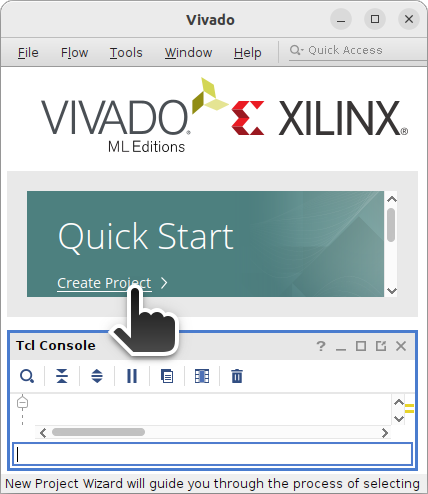

It should be an RTL Project with no source files to start.

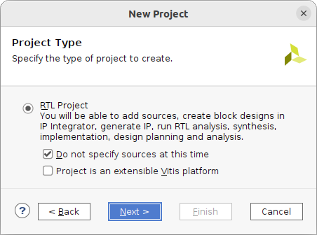

Choose the FPGA to target:

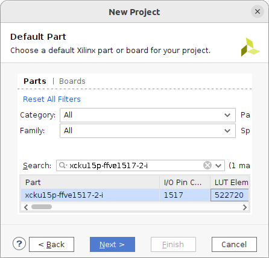

Create a Block Design:

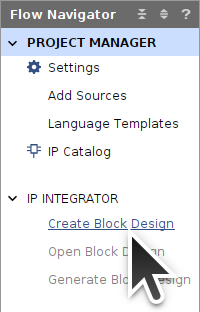

Add IP Blocks:

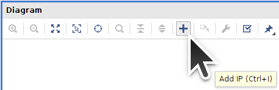


#### Add XDMA Block

Add an XDMA Block:

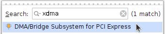

Run Block Automation:

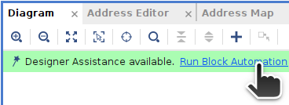

Choose PCIe Lane Width and Link Speed compatible with your target board. Select **AXI Memory Mapped** for the *DMA interface* and add an AXI Lite interface.

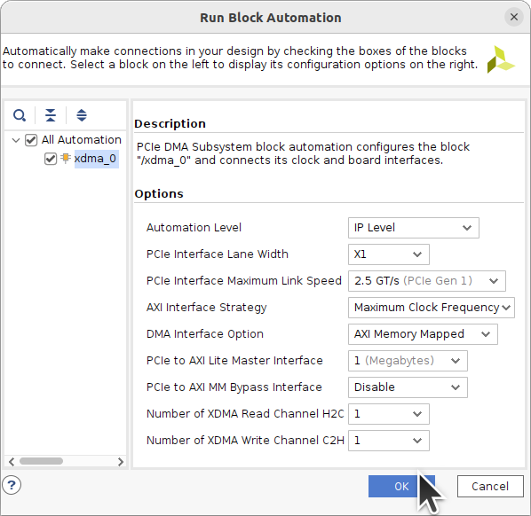

Block Automation should add the external PCIe TX+RX, Reset, and Clock signals:

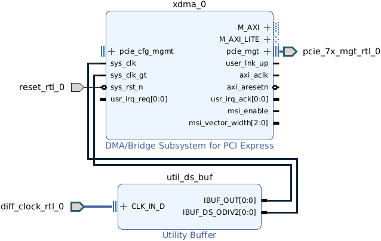

Double-click the `xdma_0` Block to open it up for customization. Notice *AXI Data Width* is 64-Bit.

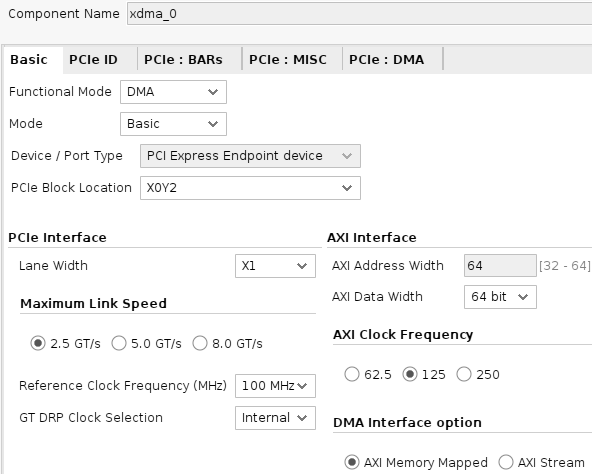

The *PCIe Block Location* chosen should be the closest PCIE Block adjacent to the transceiver Quad that the PCIe lanes are connected to on your FPGA board. Refer to the [Device Packaging and Pinouts Product Specification User Guide](https://docs.xilinx.com/r/en-US/ug575-ultrascale-pkg-pinout/XCKU15P-and-XQKU15P-Bank-Diagrams).

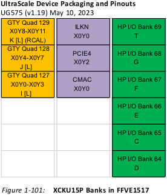

Set the PCIe ID *Base Class* to **Memory Controller** as the *Sub Class* to **Other memory controller**.

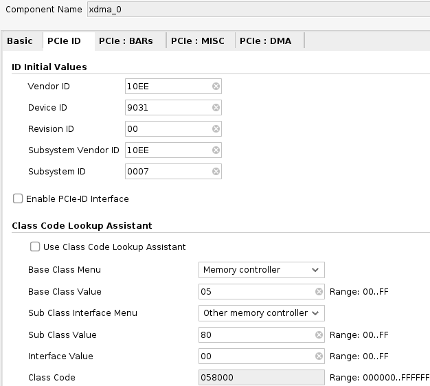

A *PCIe to AXI Translation* offset is useful to make sure the *Size* of your AXI Lite BAR overlaps the address space of all peripheral blocks. This is useful when a soft-core processor has its [peripherals in a sequence at some address range](https://en.wikipedia.org/wiki/Memory-mapped_I/O_and_port-mapped_I/O) like `0x7001000`, `0x7002000`, `0x7003000`, etc. Leave it at `0` unless you have a reason to change it. It is set to a non-zero value in this example for illustrative purposes so that readers are aware of it when communicating with other's projects. The offset should be `0` or [larger than *Size*](https://support.xilinx.com/s/question/0D52E00006hpbPJSAY/pcie-to-axi-translation-setting-for-dma-bypass-interface-not-being-applied?language=en_US): `0x40000000 > 1MB==1048576==0x100000`. This offset becomes the lowest accessible memory address. All `M_AXI_LITE` IP Block addresses must be greater than the offset.


The XDMA Driver will create a `/dev/xdma0_?` file for each channel. Multiple channels allow multiple programs or threads to access the AXI blocks in your design.

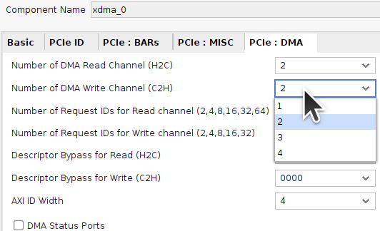


#### Add SmartConnect Blocks

Add AXI SmartConnect:

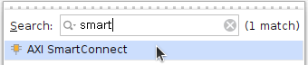

For this project only one of each interface is required.

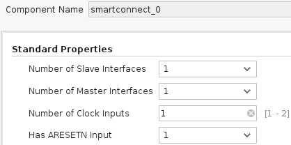

Both the **M_AXI** and **M_AXI_LITE** interfaces should have their own SmartConnect block. Connect their *aclk* input to the `xdma_0` block's *axi_aclk* and their *aresetn* input to *axi_aresetn*. Connect the `S00_AXI` port of one block to `M_AXI` of the XDMA Block and similarly for `M_AXI_LITE`.

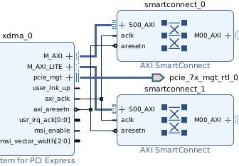


#### Add BRAM Controller Blocks

Add AXI BRAM Controller:

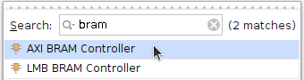

Add a BRAM Controller for each SmartConnect interface and connect their `S_AXI` ports to the corresponding `M00_AXI` port of the SmartConnect blocks.

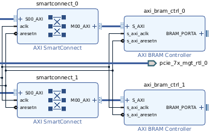

Double-click the `axi_bram_ctrl_0` block connected to the PCIe **M_AXI** interface and choose a Data Width that matches the *AXI Data Width* of the `xdma_0` block which is 64-Bit for this example. The Number of BRAM interfaces is set to 1 to simplify the design.

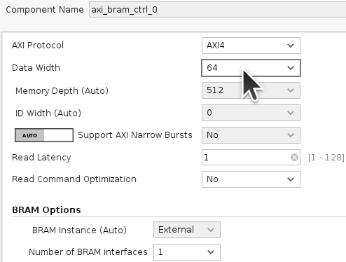

Double-click the `axi_bram_ctrl_1` block connected to the PCIe **M_AXI_LITE** interface and choose *AXI4LITE* as the AXI Protocol which forces the Data Width to 32-Bit. The Number of BRAM interfaces is set to 1 to simplify the design.

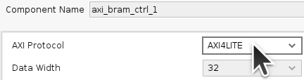

Run Block Automation:


Choose to generate a new Block Memory for each (*New Blk_Mem_Gen*):

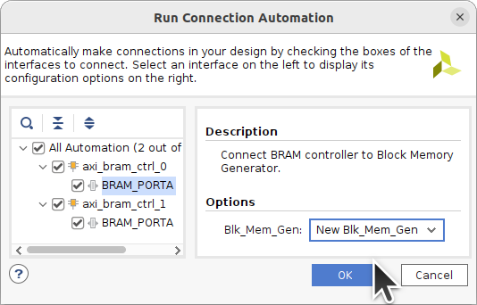

A [Block Memory Generator](https://docs.xilinx.com/v/u/en-US/pg058-blk-mem-gen) should appear for each BRAM Controller.

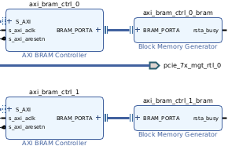

Click on the Block to Select it:

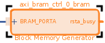

Press CTRL-R to rotate the block:

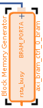


#### Memory-Mapped Block Diagram

The Block Diagram is now complete:


#### Address Editor

Open the *Address Editor* tab, right-click and select *Assign All*:

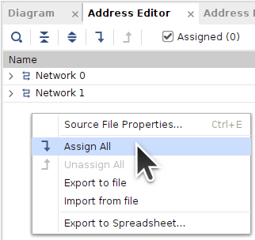

Edit the AXI Block addresses as required. The *Range* is the size that Vivado will implement for each block and this is where you set it. If the value is too large for your target FPGA then Implementation will fail. Larger sizes may have timing issues as more FPGA resources that are further apart are needed. Even though each Network can have overlapping addresses, avoid this as it can lead to confusion.

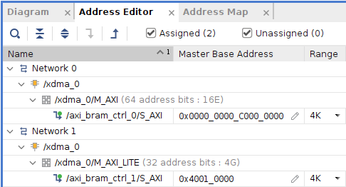


#### Constraints

Right-click in the *Sources* window to *Add Sources*:

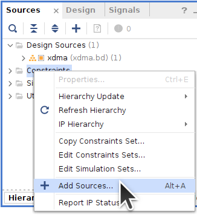

Add or Create a Constraints File:

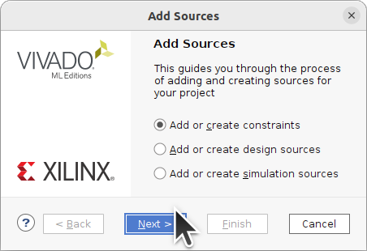

Create File:

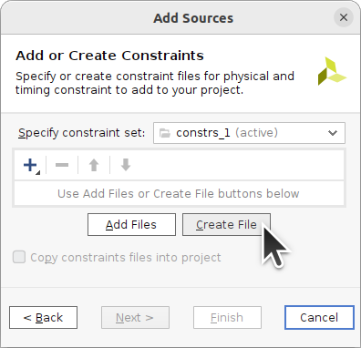

Name the Constraints File:

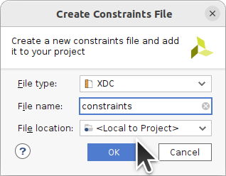

Double-click the `constraints.xdc` file to edit it.

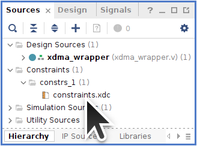

You will need to edit the PCIe TX/RX, Reset, and Clock signals to your board's pins. The TX/RX and Clock signals are differential but only the positive terminals need to be set as that restricts the other terminal. `CONFIG_MODE` and other `BITSTREAM` settings may also need to be set for your target board.
```
set_property PACKAGE_PIN AH36 [get_ports {pcie_7x_mgt_rtl_0_rxp[0]}]

set_property PACKAGE_PIN AB27 [get_ports {diff_clock_rtl_0_clk_p[0]}]
create_clock -name sys_clk -period 10.000 [get_ports diff_clock_rtl_0_clk_p]

set_property PACKAGE_PIN F2 [get_ports reset_rtl_0]
set_property IOSTANDARD LVCMOS33 [get_ports reset_rtl_0]
set_false_path -from [get_ports reset_rtl_0]

set_property CONFIG_MODE SPIx8 [current_design]
set_property BITSTREAM.GENERAL.COMPRESS TRUE [current_design]
# ... rest of BITSTREAM settings ...
```


#### HDL Wrapper

Right-click on your Block Diagram (`.bd`) design file and choose *Create HDL Wrapper*:

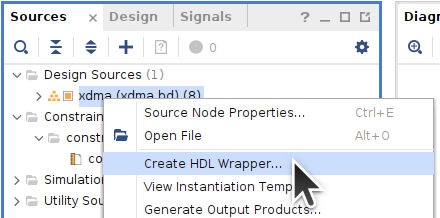

Let Vivado Manage the HDL Wrapper file:

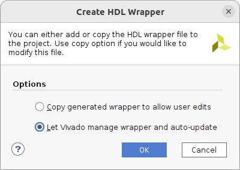


#### Generate Bitstream

The source files should now be ready for Bitsream generation:

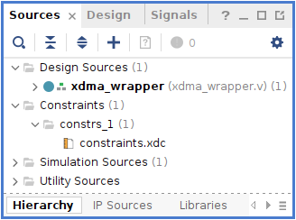

Generate the Bitstream:

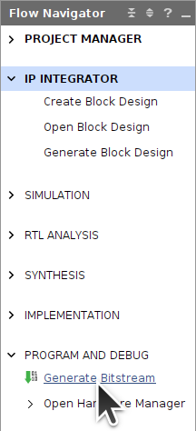

Synthesis and Implementation should take about 10 minutes:

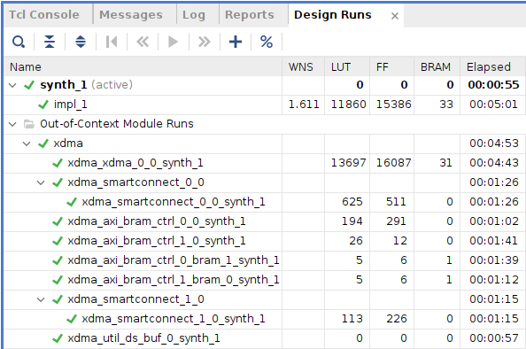

Generate a Memory Configuration File and follow your board's instructions for programming.

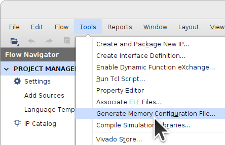


## Creating an AXI4-Stream XDMA Block Diagram Design

This procedure will recreate the design in [`xdma_stream.tcl`](xdma_stream.tcl), which can also be `source`'ed in Vivado and [retargeted to other FPGAs and/or boards](#recreating-a-project-from-a-tcl-file) to avoid the following.


It should be an RTL Project with no source files to start.


Choose the FPGA to target:


Create a Block Design:


Add IP Blocks:


#### Add XDMA Stream Block

Add an XDMA Block:


Run Block Automation:


Choose PCIe Lane Width and Link Speed compatible with your target board. Select **AXI Stream** as the *DMA Interface* and add an AXI Lite interface:


Block Automation should add the external PCIe TX+RX, Reset, and Clock signals:

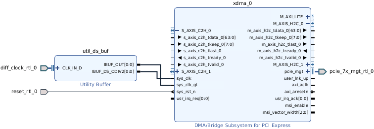

Double-click the `xdma_0` Block to open it up for customization. Notice *AXI Data Width* is 64-Bit.

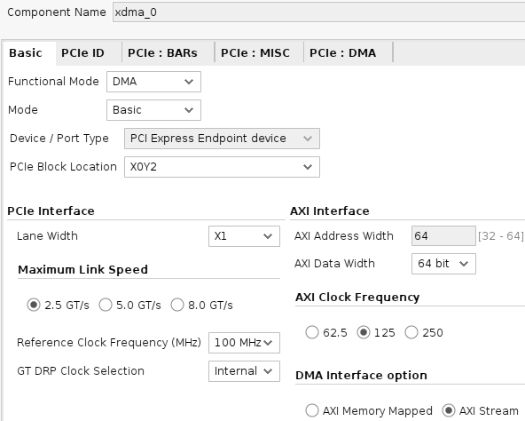

The *PCIe Block Location* chosen should be the closest PCIE Block adjacent to the transceiver Quad that the PCIe lanes are connected to on your FPGA board. Refer to the [Device Packaging and Pinouts Product Specification User Guide](https://docs.xilinx.com/r/en-US/ug575-ultrascale-pkg-pinout/XCKU15P-and-XQKU15P-Bank-Diagrams).


Set the PCIe ID *Base Class* to **Memory Controller** as the *Sub Class* to **Other memory controller**.


A *PCIe to AXI Translation* offset is useful to make sure the *Size* of your AXI Lite BAR overlaps the address space of all peripheral blocks. This is useful when a soft-core processor has its [peripherals in a sequence at some address range](https://en.wikipedia.org/wiki/Memory-mapped_I/O_and_port-mapped_I/O) like `0x7001000`, `0x7002000`, `0x7003000`, etc. Leave it at `0` unless you have a reason to change it. It is set to a non-zero value in this example for illustrative purposes so that readers are aware of it when communicating with other's projects. The offset should be `0` or [larger than *Size*](https://support.xilinx.com/s/question/0D52E00006hpbPJSAY/pcie-to-axi-translation-setting-for-dma-bypass-interface-not-being-applied?language=en_US): `0x40000000 > 1MB==1048576==0x100000`. This offset becomes the lowest accessible memory address. All `M_AXI_LITE` IP Block addresses must be greater than the offset.


Each channel has an AXI-Stream circuit: `S_AXIS_C2H_?` or `M_AXIS_H2C_?`. The XDMA Driver will create a `/dev/xdma0_c2h_?` or `/dev/xdma0_h2c_?` file for each channel. 


Click on the `+` next to the `S_AXIS_C2H_0` and `M_AXIS_H2C_0` channels to expand them. Note the `tdata` width. It is 64-Bits for this demo. Connect `S_AXIS_C2H_1` and `M_AXIS_H2C_1` to each other for loopback testing.


#### AXI4-Stream Broadcaster Block

Add an [AXI4-Stream Broadcaster](https://docs.xilinx.com/r/en-US/pg085-axi4stream-infrastructure/AXI4-Stream-Broadcaster?tocId=lTRZ8UtIrjz6JIc8NcwYXg) block which will take a 64-Bit=8-Byte input stream and output two 32-Bit=4-Byte streams. Connect its `S_AXIS` input to `M_AXIS_H2C_0` of the XDMA Block. Its *aclk* should connect to the XDMA block's *axi_aclk*. Its *aresetn* should connect to the XDMA block's *axi_aresetn*.

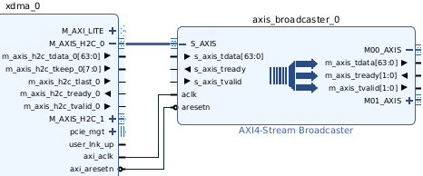

Set it up to convert an 8-Byte=64-Bit input stream into two 4-Byte=32-Bit output streams:


In the *Stream Splitting Options* tab, one of the output streams is set up to be the lower 32-bits of the input and the second stream is the upper 32-bits.


#### Floating-Point Block

Add a [Floating-Point](https://docs.xilinx.com/v/u/en-US/pg060-floating-point) block to the stream as an example of something useful. Connect its `S_AXIS_?` inputs to the `M??_AXIS` outputs of the *AXI4-Stream Broadcaster*. Its *aclk* and *aresetn* signals should connect to *axi_aclk* and *axi_aresetn* of the XDMA Block.

Each pair of 32-bit=4-byte single precision floating-point values in the 64-Bit=8-Byte Host-to-Card (H2C) stream gets multiplied to produce a floating-point value in the 64-Bit=8-Byte Card-to-Host (C2H) stream. Half as many reads from C2H are necessary as writes to H2C.


The floating-point block is set up to multiply the inputs.


Full DSP usage is set to maximize throughput.


The interface is set up as *Blocking* so that the AXI4-Stream interfaces include `tready` signals like the rest of the Stream blocks.


#### Data Width Converter

Add an [AXI4-Stream Data Width Converter](https://docs.xilinx.com/r/en-US/pg085-axi4stream-infrastructure/AXI4-Stream-Data-Width-Converter?tocId=XeJGiRyJ7jaFrWoPmP_A0w). Connect its `S_AXIS` input to the 32-Bit=4-Byte `M_AXIS_RESULT` output of the Floating-Point block. Connect its output `M_AXIS` port to the `S_AXIS_C2H_0` port of the XDMA Block. Its *aclk* and *aresetn* signals should connect to *axi_aclk* and *axi_aresetn* of the XDMA Block.


Set it up to convert its 32-Bit=4-Byte input into a 64-Bit=8-Byte output compatible with the C2H port of the XDMA Block. It will use a FIFO to convert pairs of 32-Bit=4-Byte inputs into 64-Bit=8-Byte outputs.


#### M_AXI_LITE Blocks

##### Add M_AXI_LITE SmartConnect Block to XDMA Stream

Add AXI SmartConnect:


For this project only one of each interface is required.


Connect its *aclk* input to the `xdma_0` block's *axi_aclk* and its *aresetn* input to *axi_aresetn*. Connect the `S00_AXI` port of the SmartConnect block to the `M_AXI_LITE` port of the XDMA Block.


##### Add BRAM Controller Blocks to XDMA Stream

Add an AXI BRAM Controller:


Connect its `S_AXI` port to a `M??_AXI` port of the SmartConnect block.


Double-click the `axi_bram_ctrl_0` block connected to the PCIe **M_AXI_LITE** interface and choose *AXI4LITE* as the AXI Protocol which forces the Data Width to 32-Bit. The Number of BRAM interfaces is set to 1 to simplify the design.


Run Block Automation:


Choose to generate a new Block Memory (*New Blk_Mem_Gen*) for the BRAM Controller:


A [Block Memory Generator](https://docs.xilinx.com/v/u/en-US/pg058-blk-mem-gen) should appear for each BRAM Controller.


Click on the Block to Select it:


Press CTRL-R to rotate the block:


##### M_AXI_LITE BRAM Circuit Diagram

Finished BRAM Block connected to **M_AXI_LITE**. Adding other low-throughput register-like blocks such as [GPIO](https://docs.xilinx.com/v/u/en-US/pg144-axi-gpio) is similarly accomplished by adding more **M??_AXI** ports to the SmartConnect Block.


#### Stream Block Diagram

The resulting complete XDMA Stream Block Diagram:


[Expanded view](img/xdma_stream_Block_Diagram.png).


#### M_AXI_LITE Addresses

Open the *Address Editor* tab, right-click and select *Assign All*:


Edit the AXI Block addresses as required. The *Range* is the size that Vivado will implement for each block and this is where you set it. If the value is too large for your target FPGA then Implementation will fail. Larger sizes may have timing issues as more FPGA resources that are further apart are needed.


#### XDMA Stream Constraints

Right-click in the *Sources* window to *Add Sources*:


Add or Create a Constraints File:


Create File:


Name the Constraints File:


Double-click the `constraints.xdc` file to edit it.


You will need to edit the PCIe TX/RX, Reset, and Clock signals to your board's pins. The TX/RX and Clock signals are differential but only the positive terminals need to be set as that restricts the other terminal. `CONFIG_MODE` and other `BITSTREAM` settings may also need to be set for your target board.
```
set_property PACKAGE_PIN AH36 [get_ports {pcie_7x_mgt_rtl_0_rxp[0]}]

set_property PACKAGE_PIN AB27 [get_ports {diff_clock_rtl_0_clk_p[0]}]
create_clock -name sys_clk -period 10.000 [get_ports diff_clock_rtl_0_clk_p]

set_property PACKAGE_PIN F2 [get_ports reset_rtl_0]
set_property IOSTANDARD LVCMOS33 [get_ports reset_rtl_0]
set_false_path -from [get_ports reset_rtl_0]

set_property CONFIG_MODE SPIx8 [current_design]
set_property BITSTREAM.GENERAL.COMPRESS TRUE [current_design]
# ... rest of BITSTREAM settings ...
```


#### XDMA Stream HDL Wrapper

Right-click on your Block Diagram (`.bd`) design file and choose *Create HDL Wrapper*:


Let Vivado Manage the HDL Wrapper file:


#### Generate XDMA Stream Bitstream

The source files should now be ready for Bitsream generation:


Generate the Bitstream:


Synthesis and Implementation should take about 10 minutes:


Generate a Memory Configuration File and follow your board's instructions for programming.


## Recreating a Project from a Tcl File

Run the [`source`](https://docs.xilinx.com/r/2022.2-English/ug939-vivado-designing-with-ip-tutorial/Source-the-Tcl-Script?tocId=7apMNdBzAEx4udRnUANS9A) command in the Vivado *Tcl Console* to recreate a project. The [`constraints.xdc`](constraints.xdc) file needs to be in the same directory.
```
pwd
cd DOWNLOAD_DIRECTORY
dir
source PROJECT_NAME.tcl
```


### Porting the Design to Another FPGA

If your board and target FPGA are different than those in the `.tcl` project file, the design can be re-targeted.

Under *Tools->Settings*, change the **Project Device**.


The project's IP will now be out-of-date. Run *Report IP Status*.


Select all the IP check boxes and run *Upgrade Selected*.


The IP should upgrade successfully if it is not too different an FPGA.


Rerun *IP Status* to confirm everything has upgraded.


[Edit the constraints file](#constraints) to target your FPGA board.


Generate the Bitstream:


## Install XDMA Driver from dma_ip_drivers

Download and extract the November 10, 2023, commit a93d4a4 version of Xilinx's [DMA IP Drivers](https://github.com/Xilinx/dma_ip_drivers/tree/a93d4a4870e41d152b33aebb3f869eefb11aa691).
```Shell
cd ~
wget https://codeload.github.com/Xilinx/dma_ip_drivers/zip/a93d4a4870e41d152b33aebb3f869eefb11aa691 -O dma_ip_drivers-a93d4a4.zip
unzip dma_ip_drivers-a93d4a4.zip
mv dma_ip_drivers-a93d4a4870e41d152b33aebb3f869eefb11aa691 dma_ip_drivers

cd dma_ip_drivers/XDMA/linux-kernel/xdma/
make DEBUG=1
sudo make install

sudo depmod -a
sudo ldconfig

cd ~/dma_ip_drivers/XDMA/linux-kernel/tools
make

sudo reboot
```


## Useful Links

- [innova2_xdma_demo](https://github.com/mwrnd/innova2_xdma_demo) has notes on communicating with peripheral blocks such as GPIO and bandwidth testing of memory blocks using [dd](https://manpages.ubuntu.com/manpages/focal/en/man1/dd.1.html).
- [Xilinx DMA PCIe Tutorial](https://www.linkedin.com/pulse/xilinx-dma-pcie-tutorial-part-1-roy-messinger) by Roy Messinger on LinkedIn goes into the theory behind PCIe DMA and how XDMA block settings are related. It is based on older versions of the XDMA driver which is no longer relevant.
- [PCI Express TLP Primer](https://xillybus.com/tutorials/pci-express-tlp-pcie-primer-tutorial-guide-1) by Eli Billauer of [Xillybus](https://xillybus.com/) is a quick introduction to the PCIe Transaction Layer.
- [AXI Basics 1 - Introduction to AXI](https://support.xilinx.com/s/article/1053914)


