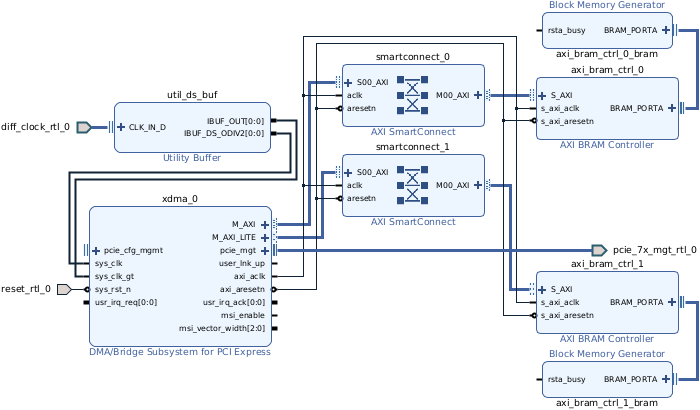
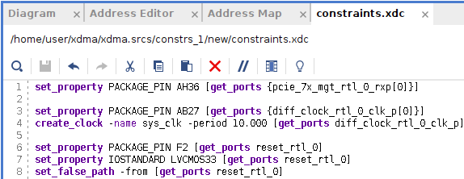

**Work-In-Progress**: Testing underway. PCIe 2.5GT/s x1 with a 64-Bit AXI Bus does not work for me.


# XDMA Communication

Tutorial for writing software on Linux to communicate with an [XDMA](https://docs.xilinx.com/r/en-US/pg195-pcie-dma/Introduction)-based FPGA design using [dma_ip_drivers](https://github.com/xilinx/dma_ip_drivers).


## QuickStart

For when you already have an [XDMA FPGA design](#creating-a-memory-mapped-xdma-block-diagram-design) and [dma_ip_drivers](#install-dma_ip_drivers) installed.

The XDMA driver creates [character device files](https://en.wikipedia.org/wiki/Device_file#Character_devices) that are [write-only and read-only](https://manpages.debian.org/bookworm/manpages-dev/open.2.en.html#File_access_mode), `/dev/xdma0_h2c_0` and `/dev/xdma0_c2h_0` respectively. They allow direct access to the FPGA design's AXI Bus. To read from an AXI Block at address `0xC0000000` you would read from address `0xC0000000` of the `/dev/xdma0_c2h_0` (Card-to-Host) file. To write you would write to the appropriate address of `/dev/xdma0_h2c_0` (Host-to-Card).


### Memory-Mapped M_AXI

The **M_AXI** interface is for Direct Memory Access (DMA) to AXI blocks as communication is via a sequence of Transaction Layer Packet (TLP) requests.


The [BRAM Controller Block](https://docs.xilinx.com/v/u/en-US/pg078-axi-bram-ctrl) attached to the interface has an address of `0x00000000C0000000`.


[`pread`/`pwrite`](https://manpages.ubuntu.com/manpages/jammy/en/man2/pread.2.html) combine [`lseek`](https://manpages.ubuntu.com/manpages/jammy/en/man2/lseek.2.html) and [`read`/`write`](https://manpages.ubuntu.com/manpages/jammy/en/man2/read.2.html).
```C
#include <unistd.h>

ssize_t pread(int fd, void *buf, size_t count, off_t offset);

ssize_t pwrite(int fd, const void *buf, size_t count, off_t offset);
```

The following is some minimal C code without error checking.
```C
// Using 2^12 = 4096 byte array. Size was defined in the
// Vivado FPGA Project Block Diagram Address Editor as the Data Range for BRAM
#define DATA_SIZE 4096
uint8_t buffer[DATA_SIZE];
uint64_t address = 0x00000000C0000000;
int xdma_h2cfd = 0;
int xdma_c2hfd = 0;
uint32_t val = 0;
ssize_t rc;

// Fill the buffer with data
for (int indx = 0; indx < DATA_SIZE ; indx++) { buffer[indx] = (uint8_t)indx; }

memcpy(&buffer[0], &val, 4);
printf("Buffer First Word=0x%08X before write\n", val);

// Open M_AXI H2C Host-to-Card Device as Write-Only
xdma_h2cfd = open("/dev/xdma0_h2c_0", O_WRONLY);

rc = pwrite(xdma_h2cfd, buffer, DATA_SIZE, address);

// Clear the buffer
for (int indx = 0; indx < DATA_SIZE ; indx++) { buffer[indx] = 0; }

memcpy(&buffer[0], &val, 4);
printf("Buffer First Word=0x%08X after clear\n", val);

// Open M_AXI C2H Card-to-Host Device as Read-Only
xdma_c2hfd = open("/dev/xdma0_c2h_0", O_RDONLY);

rc = pread(xdma_c2hfd, buffer, DATA_SIZE, address);

memcpy(&buffer[0], &val, 4);
printf("AXI BRAM First Word=0x%08X\n", val);
```


### M_AXI_LITE

The **M_AXI_LITE** interface is useful for single word access to register-like blocks as communication is via single Transaction Layer Packet (TLP) requests.


The [BRAM Controller Block](https://docs.xilinx.com/v/u/en-US/pg078-axi-bram-ctrl) attached to the interface has an address of `0x40010000`.


However, the XDMA Block is set up with a PCIe to AXI Translation offset of `0x40000000` which must be subtracted from the intended AXI address. This is useful for soft-core processors as it allows the 1Megabyte *Size* of the AXI-Lite BAR (Block Address Register) to overlap all attached peripheral blocks.


[`pread`/`pwrite`](https://manpages.ubuntu.com/manpages/jammy/en/man2/pread.2.html) combine [`lseek`](https://manpages.ubuntu.com/manpages/jammy/en/man2/lseek.2.html) and [`read`/`write`](https://manpages.ubuntu.com/manpages/jammy/en/man2/read.2.html).
```C
#include <unistd.h>

ssize_t pread(int fd, void *buf, size_t count, off_t offset);

ssize_t pwrite(int fd, const void *buf, size_t count, off_t offset);
```

The following is some minimal C code without error checking. Note `count=4` is fixed as each M_AXI_LITE TLP consists of a 32-bit=4-byte data word.
```C
// The PCIe to AXI Translation Offset for the PCIe to AXI-Lite Interface
#define XDMA_PCIe_to_AXI_Translation_Offset 0x40000000

// Open M_AXI_LITE Device as Read-Write
xdma_userfd = open("/dev/xdma0_user", O_RDWR);

uint64_t address = 0x40010000 - XDMA_PCIe_to_AXI_Translation_Offset;
uint32_t data_word = 0xAA55A55A;
ssize_t rc;

rc = pwrite(xdma_userfd, &data_word, 4, address);

data_word = 0;

rc = pread(xdma_userfd, &data_word, 4, address);

printf("AXILite Address 0x%08lX has data: 0x%08X\n", address, data_word);
```


### AXI4-Stream

**AXI4-Stream** is designed for continuous throughput. Multiples of the `tdata` width of data (64-Bits for this demo) needs to be read from (C2H) or written to (H2C) the XDMA Block. If twice as much data is sent than received, reads will be 64-bits and writes will be 128-bits. Data is sent and received to address `0` as it is not stored. The data stream sinks into **S_AXIS_C2H_** and flows from **M_AXIS_H2C_** interfaces. Refer to the [xdma_stream](https://github.com/mwrnd/innova2_experiments/tree/main/xdma_stream) and [xdma_stream_512bit](https://github.com/mwrnd/innova2_experiments/tree/main/xdma_stream_512bit) projects for demonstrations.


```C
// The AXI Data Width is 64-Bit=8-Byte. Data Size must be a multiple.
// The design takes 2 float values, multiples them, then outputs 1 float
// In order to read two 32-bit float values (64-Bit), 128-bits must be sent
#define DATA_SIZE 16

int xdma_h2cfd = 0;
int xdma_c2hfd = 0;
uint8_t buffer[DATA_SIZE];
float f1 = 1.23;
float f2 = 3.21;
float f3 = 3.14;
float f4 = 4.13;
ssize_t rc;

// Open M_AXI H2C Host-to-Card Device as Write-Only
xdma_h2cfd = open("/dev/xdma0_h2c_0", O_WRONLY);

// Open M_AXI C2H Card-to-Host Device as Read-Only
xdma_c2hfd = open("/dev/xdma0_c2h_0", O_RDONLY);

// fill the buffer with 4 floating-point values
memcpy(&buffer[0],  &f1, 4);
memcpy(&buffer[4],  &f2, 4);
memcpy(&buffer[8],  &f3, 4);
memcpy(&buffer[12], &f4, 4);

printf("f1=%f, f2=%f, f1*f2=%f,  f3=%f, f4=%f, f3*f4=%f\n",
    f1, f2, (f1*f2), f3, f4, (f3*f4));

// Write the 4 float values to the AXI-Stream interface - 128-Bits = 2*64-Bit
rc = pwrite(xdma_h2cfd, buffer, DATA_SIZE, 0);

// Read the resulting 2 float values from the AXI-Stream interface - 64-Bits
rc = pread(xdma_c2hfd, buffer, (DATA_SIZE/2), 0);

memcpy(&f1, &buffer[0], 4);
memcpy(&f2, &buffer[4], 4);

printf("f1*f2=%f, f3*f4=%f\n", f1, f2);
```


## Creating a Memory-Mapped XDMA Block Diagram Design

Start Vivado and choose Create Project:
```
sudo /tools/Xilinx/Vivado/2022.2/bin/vivado
```


It should be an RTL Project with no source files to start.


Choose the FPGA to target:


Create a Block Design:


Add IP Blocks:


#### Add XDMA Block

Add XDMA Block:


Run Block Automation:


Choose PCIe Lane Width and Link Speed, select **AXI Memory Mapped** for the DMA interface and add an AXI Lite interface.


Block Automation should add the external PCIe TX+RX, Reset, and Clock signals:


Double-click the `xdma_0` Block to open it up for customization.


The *PCIe Block Location* chosen should be the closest PCIE Block adjacent to the transceiver Quad that the PCIe lanes are connected to on your FPGA board. The PCIe Lane Width and Link Speed throughput needs to match the AXI Data Width and Clock Frequency throughput. These four settings are interrelated. Note the Data Width is 64-Bit with these selections.


A *PCIe to AXI Translation* offset is useful to make sure the *Size* of your AXI Lite BAR overlaps the address space of all peripheral blocks. This is useful when a soft-core processor has all of its peripherals in some specific address range. The offset can be `0`.


The XDMA Driver will create a `/dev/xdma0_?` file for each channel. Multiple channels allow multiple programs or threads to access the AXI blocks in your design. For AXI4-Stream designs, each channel has its own circuit.


#### Add SmartConnect Blocks

Add AXI SmartConnect:


For this project only one of each interface is required.


Both the **M_AXI** and **M_AXI_LITE** interfaces should have their own SmartConnect block. Connect their *aclk* input to the `xdma_0` block's *axi_aclk* and their *aresetn* input to *axi_aresetn*.


#### Add BRAM Controller Blocks

Add AXI BRAM Controller:


Add blocks for each SmartConnect interface:


Run Block Automation and choose to generate a new Block Memory for each (*New Blk_Mem_Gen*):


A [Memory Generator Block](https://docs.xilinx.com/v/u/en-US/pg058-blk-mem-gen) should appear for each BRAM Controller.


Double-click the `axi_bram_ctrl_0` block connected to the PCIe **M_AXI** interface and choose 64-Bit as the Data Width. This matches the AXI Data Width of the `xdma_0` block. The Number of BRAM interfaces is set to 1 to simplify the design.


Double-click the `axi_bram_ctrl_1` block connected to the PCIe **M_AXI_LITE** interface and choose *AXI4LITE* as the AXI Protocol which forces the Data Width to 32-Bit.


#### Memory-Mapped Block Diagram

The Block Diagram is now complete:




#### Address Editor

Open the *Address Editor* tab, right-click and select *Assign All*:


You can edit the AXI Block addresses as required. Even though each Network can have overlapping addresses, avoid this as it can lead to confusion.


#### Constraints

Right-click in the *Sources* window to *Add Sources*:


Add or Create a Constraints File:


Create File:


Name the Constraints File:


Double-click the `constraints.xdc` file to edit it. You will need to edit the PCIe TX/RX, Reset, and Clock signals to your board's pins. The TX/RX and Clock signals are differential but only the positive terminals need to be set as that restricts the other terminal. `CONFIG_MODE` and other `BITSTREAM` settings may also need to be set for your target board.
```
set_property PACKAGE_PIN AH36 [get_ports {pcie_7x_mgt_rtl_0_rxp[0]}]

set_property PACKAGE_PIN AB27 [get_ports {diff_clock_rtl_0_clk_p[0]}]
create_clock -name sys_clk -period 10.000 [get_ports diff_clock_rtl_0_clk_p]

set_property PACKAGE_PIN F2 [get_ports reset_rtl_0]
set_property IOSTANDARD LVCMOS33 [get_ports reset_rtl_0]
set_false_path -from [get_ports reset_rtl_0]

set_property CONFIG_MODE SPIx8 [current_design]
set_property BITSTREAM.GENERAL.COMPRESS TRUE [current_design]
# ... rest of BITSTREAM settings ...
```




#### HDL Wrapper

Right-click on your Block Diagram (`.bd`) design file and choose *Create HDL Wrapper*:


Let Vivado Manage the HDL Wrapper file:


#### Generate Bitstream

The source files should now be ready for Bitsream generation:


Generate the Bitstream:


Synthesis and Implementation should take about 10minutes:


Generate a Memory Configuration File and follow your board's instructions for programming.


## Creating an AXI4-Stream XDMA Block Diagram Design

Instructions are almost identical to [Creating a Memory-Mapped XDMA Block Diagram Design](#creating-a-memory-mapped-xdma-block-diagram-design) above with the following changes:

#### Add XDMA Block

When running Block Automation, choose *AXI Stream* as the *DMA Interface*:


You can also double-click the `xdma_` block and set properties:


Select AXI Stream as the DMA Interface:


Click on the `+` next to the `S_AXIS_C2H_0` and `M_AXIS_H2C_0` channels to expand them. Note the `tdata` width. It is 64-Bits for this demo.


Add a [Floating-Point](https://docs.xilinx.com/v/u/en-US/pg060-floating-point) block that multiplies its two inputs. An [AXI4-Stream Broadcaster](https://docs.xilinx.com/r/en-US/pg085-axi4stream-infrastructure/AXI4-Stream-Broadcaster?tocId=lTRZ8UtIrjz6JIc8NcwYXg) and [AXI4-Stream Data Width Converter](https://docs.xilinx.com/r/en-US/pg085-axi4stream-infrastructure/AXI4-Stream-Data-Width-Converter?tocId=XeJGiRyJ7jaFrWoPmP_A0w) will be required to interface the floating-point block to the XDMA block as every 2 inputs have 1 output. The *Broadcaster* block splits the 64-bit input into two 32-bit float values. The *Data Width Converter* waits for two 32-bit values to convert them into a 64-bit value. Refer to the [xdma_stream_512bit](https://github.com/mwrnd/innova2_experiments/tree/main/xdma_stream_512bit) project for a demonstration.


#### Stream Block Diagram


#### AXI4-Stream Broadcaster Block

The *Broadcaster* block takes a 64-Bit=8-Byte input stream and outputs two 32-Bit=4-Byte streams.


One of the output streams is set up to be the lower 32-bits of the input and the second stream is the upper 32-bits.


#### Generate Bitstream

Generate the Bitstream:


Synthesis and Implementation should take about 10minutes:


## Recreating a Project from a Tcl File

Run the [`source`](https://docs.xilinx.com/r/2022.2-English/ug939-vivado-designing-with-ip-tutorial/Source-the-Tcl-Script?tocId=7apMNdBzAEx4udRnUANS9A) command in the Vivado *Tcl Console* to recreate a project.
```
pwd
cd DOWNLOAD_DIRECTORY
dir
source PROJECT_NAME.tcl
```


## Install dma_ip_drivers

Download and extract the March 18, 2022, commit 7859957 version of Xilinx's [DMA IP Drivers](https://github.com/Xilinx/dma_ip_drivers/tree/785995783c78b2cbec6458141c4395e204c5bd9b).
```Shell
cd ~
wget https://codeload.github.com/Xilinx/dma_ip_drivers/zip/785995783c78b2cbec6458141c4395e204c5bd9b -O dma_ip_drivers-7859957.zip
unzip dma_ip_drivers-7859957.zip
mv dma_ip_drivers-785995783c78b2cbec6458141c4395e204c5bd9b dma_ip_drivers

cd ~/dma_ip_drivers/XDMA/linux-kernel/xdma/
make DEBUG=1
sudo make install

sudo depmod -a
sudo ldconfig

cd ~/dma_ip_drivers/XDMA/linux-kernel/tools
make

sudo reboot
```


## Useful Links

- [innova2_xdma_demo](https://github.com/mwrnd/innova2_xdma_demo) has notes on communicating with peripheral blocks such as GPIO and bandwidth testing of memory blocks using [dd](https://manpages.ubuntu.com/manpages/focal/en/man1/dd.1.html).
- [Xilinx DMA PCIe Tutorial](https://www.linkedin.com/pulse/xilinx-dma-pcie-tutorial-part-1-roy-messinger) by Roy Messinger on LinkedIn goes into the theory behind PCIe DMA and how XDMA block settings are related.
- [PCI Express TLP Primer](https://xillybus.com/tutorials/pci-express-tlp-pcie-primer-tutorial-guide-1) by Eli Billauer of [Xillybus](https://xillybus.com/) is a quick introduction to the PCIe Transaction Layer.


