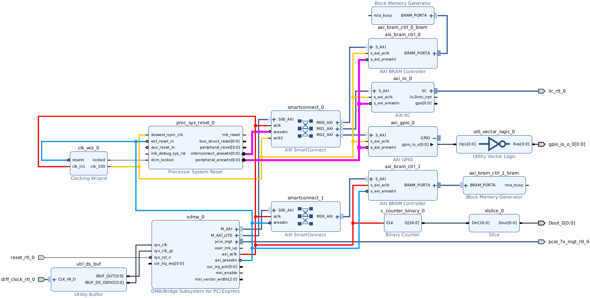
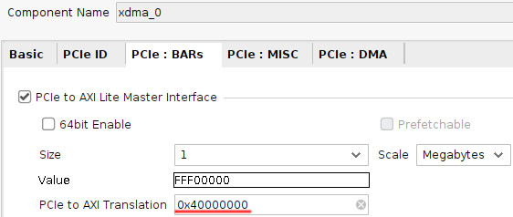
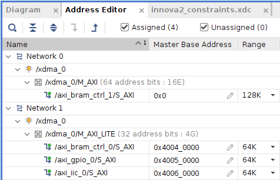
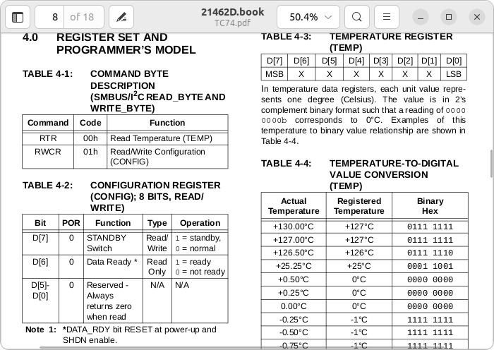
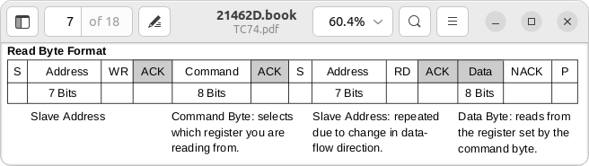
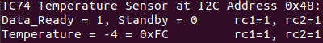

# embeddedsw AXI IIC (I2C) over XDMA

Tutorial for communicating over [XDMA](https://docs.xilinx.com/r/en-US/pg195-pcie-dma) with an [AXI IIC (I2C) IP Block](https://docs.xilinx.com/v/u/en-US/pg090-axi-iic). Project files for the Innova2 [are available](https://github.com/mwrnd/innova2_xdma_opencapi).


## Block Diagram Design

The Block Diagram design connects an AXI IIC Block to the XDMA's `M_AXI_LITE` port through an [AXI SmartConnect IP Block](https://docs.xilinx.com/r/en-US/pg247-smartconnect).



A PCIe-to-AXI Translation offset is used for `AXI_LITE` to simplify [memory-mapping](https://manpages.ubuntu.com/manpages/focal/en/man2/mmap.2.html) the IIC (I2C) Block.



The only relevant AXI address is the `0x40060000` of the `IIC_0` Block.

| Block                      | Address (Hex) | Size   |
| -------------------------- |:-------------:| :----: |
| `M_AXI` `BRAM_CTRL_1`      |  0x00000000   |  128K  |
| `M_AXI_LITE` `BRAM_CTRL_0` |  0x40040000   |   64K  |
| `M_AXI_LITE` `GPIO_3`      |  0x40050000   |   64K  |
| `M_AXI_LITE` `IIC_0`       |  0x40060000   |   64K  |




## Using Xilinx embeddedsw Library

Xilinx's [embeddedsw Library](https://github.com/Xilinx/embeddedsw) contains drivers for Xilinx IP Blocks. The drivers are designed to work with various processor cores such as MicroBlaze, Zynq/ARM, or RISCV that are on the same AXI Bus as the IP Blocks. The drivers map AXI Bus IP Blocks to the processor's own memory. Any `AXI_LITE`-compatible Xilinx IP Blocks that work in polled mode can therefore be communicated with over XDMA by memory-mapping the IP Block memory.

Refer to the [XDMA Communication Tutorial](https://github.com/mwrnd/notes/tree/main/XDMA_Communication) for instructions on using and setting up [Xilinx's XDMA Drivers](https://github.com/Xilinx/dma_ip_drivers/tree/master/XDMA/linux-kernel).


### Adapting embeddedsw for use over XDMA

The [embeddedsw library](https://xilinx-wiki.atlassian.net/wiki/spaces/A/pages/18841745/Baremetal+Drivers+and+Libraries) is designed to be used from [Xilinx Vitis](https://www.xilinx.com/products/design-tools/vitis.html) and expects files such as [`bspconfig.h`](bspconfig.h) and [`xpseudo_asm.h`](xpseudo_asm.h) which are empty when used with XDMA.

The [IIC library](https://xilinx.github.io/embeddedsw.github.io/iic/doc/html/api/index.html) requires some defines which can be set in the [`Makefile`](Makefile).
```
CFLAGS += -DXPAR_IIC_0_GPO_WIDTH=0 -DXPAR_IIC_1_GPO_WIDTH=0 -D__LITTLE_ENDIAN__=0
```

The following source files are required for IIC:
```
SRC_FILES  = $(PROGRAM).c
SRC_FILES += ./embeddedsw/lib/bsp/standalone/src/common/inbyte.c
SRC_FILES += ./embeddedsw/lib/bsp/standalone/src/common/outbyte.c
SRC_FILES += ./embeddedsw/lib/bsp/standalone/src/common/print.c
SRC_FILES += ./embeddedsw/lib/bsp/standalone/src/common/xil_assert.c
SRC_FILES += ./embeddedsw/lib/bsp/standalone/src/common/xil_mem.c
SRC_FILES += ./embeddedsw/lib/bsp/standalone/src/common/xil_printf.c
SRC_FILES += ./embeddedsw/lib/bsp/standalone/src/common/xil_testcache.c
SRC_FILES += ./embeddedsw/lib/bsp/standalone/src/common/xil_testio.c
SRC_FILES += ./embeddedsw/lib/bsp/standalone/src/common/xil_testmem.c
SRC_FILES += ./embeddedsw/lib/bsp/standalone/src/common/xil_util.c
SRC_FILES += ./embeddedsw/lib/bsp/standalone/src/common/xpm_init.c
SRC_FILES += ./embeddedsw/XilinxProcessorIPLib/drivers/iic/src/xiic.c
SRC_FILES += ./embeddedsw/XilinxProcessorIPLib/drivers/iic/src/xiic_dyn_master.c
SRC_FILES += ./embeddedsw/XilinxProcessorIPLib/drivers/iic/src/xiic_g.c
SRC_FILES += ./embeddedsw/XilinxProcessorIPLib/drivers/iic/src/xiic_intr.c
SRC_FILES += ./embeddedsw/XilinxProcessorIPLib/drivers/iic/src/xiic_l.c
SRC_FILES += ./embeddedsw/XilinxProcessorIPLib/drivers/iic/src/xiic_master.c
SRC_FILES += ./embeddedsw/XilinxProcessorIPLib/drivers/iic/src/xiic_multi_master.c
SRC_FILES += ./embeddedsw/XilinxProcessorIPLib/drivers/iic/src/xiic_options.c
SRC_FILES += ./embeddedsw/XilinxProcessorIPLib/drivers/iic/src/xiic_selftest.c
SRC_FILES += ./embeddedsw/XilinxProcessorIPLib/drivers/iic/src/xiic_sinit.c
SRC_FILES += ./embeddedsw/XilinxProcessorIPLib/drivers/iic/src/xiic_slave.c
SRC_FILES += ./embeddedsw/XilinxProcessorIPLib/drivers/iic/src/xiic_stats.c

# Omit the following which are platform specific and break on x86_64
# SRC_FILES += ./embeddedsw/lib/bsp/standalone/src/common/xplatform_info.c
# SRC_FILES += ./embeddedsw/lib/bsp/standalone/src/common/xil_sleepcommon.c
```


### Using Xilinx embeddedsw IIC Library

For the example, communication will be with a [TC74 Temperature Sensor](https://www.microchip.com/en-us/product/tc74). [`innova2_xdma_opencapi_iic_tc74_test.c`](innova2_xdma_opencapi_iic_tc74_test.c) contains a complete C program. Refer to [IIC Protocol and Programming Sequence](https://support.xilinx.com/s/article/1072248?language=en_US) for more information on IIC (I2C).

Open the XDMA `M_AXI_LITE` character device file:
```
xdma_userfd = open("/dev/xdma0_user", O_RDWR);
```

Use [`mmap`](https://manpages.ubuntu.com/manpages/noble/man2/mmap.2.html) to map the AXI IIC memory space to a local array. Note the address is `0x60000` which is `0x40060000 - 0x40000000`, the AXI address minus the PCIe-to-AXI Translation offset. The size is `65536` which is equal to the `64K` **Range** of the assigned AXI IIC Address space.
```
void* iic_mem_mapped = mmap(NULL, 65536, (PROT_READ | PROT_WRITE), MAP_SHARED, xdma_userfd, 0x60000);
```

The I2C Address of the **TC74A0-3.3VAT** is `1001 000 = 0x48`. This address is shifted left by one bit and a R/W bit is added by the IIC code to produce the correct I2C address on the wires. The TC74 is available in other versions which change the I2C address.
```
u8 TempSensorAddress = 0x48;
```



The TC74 uses consecutive start conditions to send a command then read the resulting data.



This is accomplished in IIC Polled Mode using [`XIic_Send`](https://xilinx.github.io/embeddedsw.github.io/iic/doc/html/api/group___overview.html#ga907c577b53407fb0bfc98d0ca37ee221) with `XIIC_REPEATED_START` followed by [`XIic_Recv`](https://xilinx.github.io/embeddedsw.github.io/iic/doc/html/api/group___overview.html#ga7a848238d75ff57837afa5a58f11f326)
```
TxMsg[0] = 0x00; // Command Byte = 0x00 = RTR = Read Temperature
XIic_Send((UINTPTR)iic_mem_mapped, TempSensorAddress, TxMsg, 1, XIIC_REPEATED_START);
XIic_Recv((UINTPTR)iic_mem_mapped, TempSensorAddress, &temp, 1, XIIC_STOP);
```

When run in a complete program with some debugging info the result is:


After using some [Freeze Spray](https://mgchemicals.com/products/electronics-maintenance/freeze-spray-electronics/cooling-spray-electronics/) on the sensor the result is below 0:




